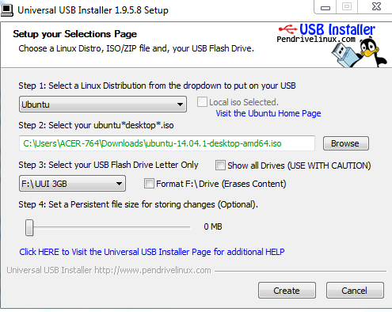
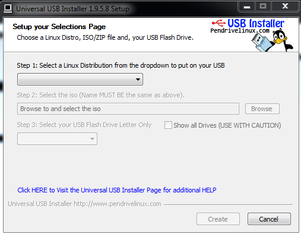
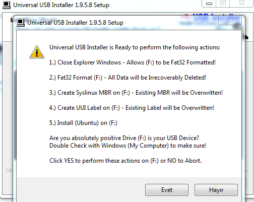
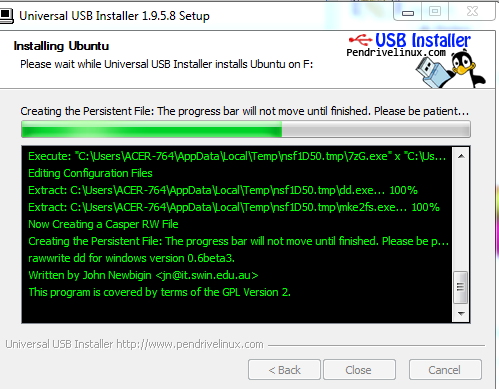
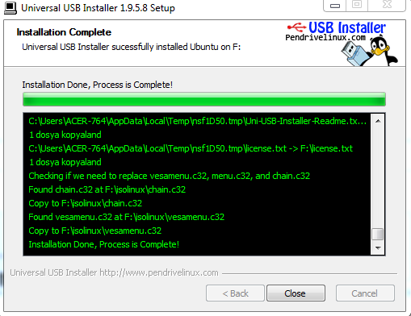

**Merhabalar,**\
Bugün size flash belleğe ubuntu kurmaktan bahsedeceğim. Open source seven
insanlar için Linux her zaman en çekici gelen işletim sistemi olmuştur. Fakat
program desteği, driver sorunları derken linux tek işletim sistemi olarak
kullanmak oldukça zor bir olay haline geliyor. İşte bunun için çok güzel
çözümler var. Bunlardan bir tanesi aynı hard disk üzerine ikinci bir işletim
sistemi kurmak. Bu çözüm bana daha zor ve karışık geliyor, benim tercih ettiğim
ise bir flash belleğe Ubuntu kurup gerekli zamanlarda bilgisayarı onun üzerinden
boot ederek Linuxun özgür dünyasına dalmak. Evet anlatıma geçersem aslında çok
basit olduğunu göreceksiniz.

**Gerekenler**

- Universal USB Installer Programı
  ([indirmek için tıklayınız.](https://www.pendrivelinux.com/downloads/Universal-USB-Installer/Universal-USB-Installer-1.9.5.8.exe))
- Ubuntu ISO
  Dosyası([indirmek için tıklayınız.](https://www.ubuntu.com/download/desktop/thank-you?country=TR&version=14.04.1&architecture=amd64))
- Flash bellek en az 2 GB

Universal Usb Installer programı kurulum gerektirmiyor ve neredeyse tüm Linux
dağıtımlarını destekliyor diğer dağıtımları da deneyebilirsiniz. Belleğinizi
takıp ve gerekli dosyaları indirdikten sonra programı çalıştırabilirsiniz. Şöyle
bir pencere sizi karşılayacak;

Aşağıdakine benzer şekilde doldurabilirsiniz. 1\. Boşluğa istediğiniz linux
dağıtımı 2\. Boşluğa ISO dosyasını gösteriyoruz. 3\. Boşluğa ise üzerinde linux
kurmak istediğiniz flash belleği seçiyorsunuz. Bu adımda dikkatli olmanız
şiddetle tavsiye olunur. 4\. Olarak da depolama boyutunu flash diskinizin
boyutu-2 GB  seçebilirsiniz. Formata basarsanız daha iyi olur ama içindeki
dosyalarınız gider

Az kaldı bitiyor sabredin :) 

Eveet artık Linux'unuzu açabilirsiniz. Bilgisayarınızı yeniden başlatın ve
anakart ayarlarınıza girip boot device olarak flash belleğinizi seçebilirsiniz.
Artık yanında taşıyabileceğiniz ve bu ayarı yapabileceğiniz her yerde
kullanabileceğiniz bir bilgisayarınız var. Güle güle kullanın...

Not: Beğendiniz mi o zaman Linux'ta kullanabileceğiniz 10 güzel program yazımı
[buradan ziyaret](https://mozanunal.com/2014/12/linuxta-kullanabileceginiz-10-yararl/)
edin.
