Herkese Merhabalar,

Bugünkü yazımda Linuxta kullanabileceğiniz bir kaç yararlı programdan bahsetmek
istiyorum. Bu programlar windows kullanıcılarının aşina olduğu, güzel alternatif
programlar. Ben de kullandığım bu programları sizinle paylaşmak istedim. Yani
öyle Linux'taki en iyi 10 program bunlar, hepsi sıfır hatalı diye iddalı bir
başlıkla çıkmıyorum kaşınıza :D. Neyse programlara geçelim.

- İlk program Ubuntu Software Center. Bu program üzerinden Ubuntu'da çalışabilen
  bir çok programa ulaşabiliyorsunuz ve onları indirip kurabiliyorsunuz. Güzel
  şekilde kategorize edilmiş ve eklenti seçeneklerini seçme özelliği eklenmiş
  gerçekten hoş ve işleri kolaylaştıran bir program.

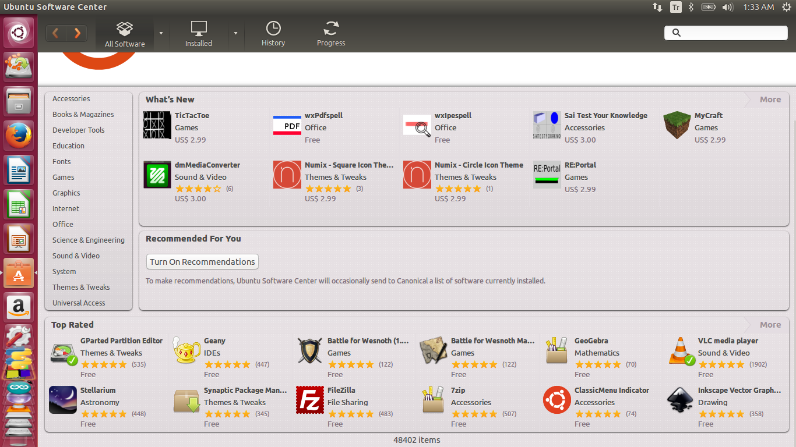

- İkincisi, olmazsa olmaz programımız Mozilla Firefox. İnternete girmek tabi ki
  Ubuntu'da da sıkça kullanılan bir eylem. Mozilla bu iş için en iyi araçlardan
  biri. Bir tarayıcıdan istenilen tüm özelliklere sahip.

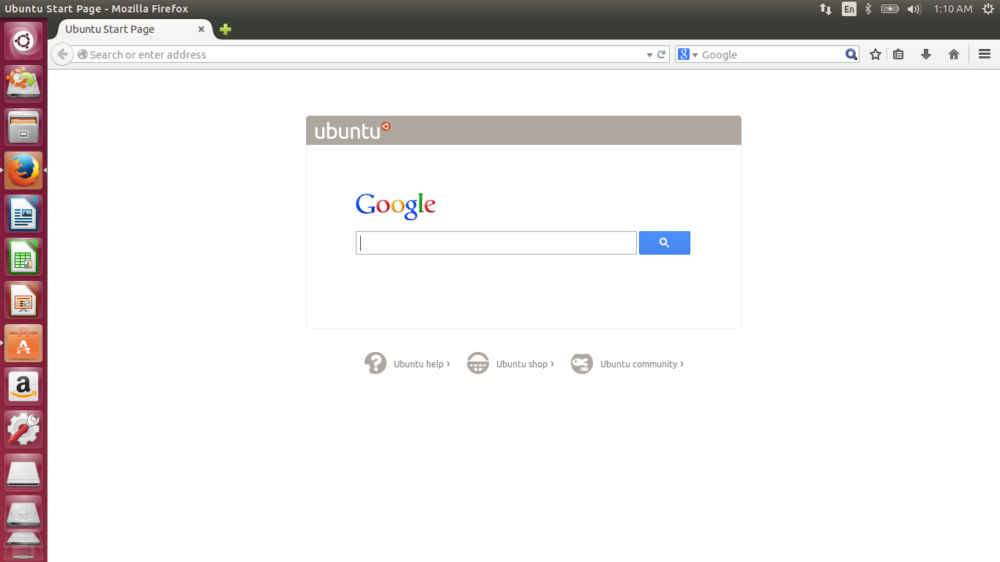

- Sıradaki programımız GIMP. Bu bir resim düzenleme programı. Özellikleri ise
  ünlü Photoshop programı ile yarışır düzeyde. Efektleri, filtreleri, layerlarla
  çalışabilme özellikleri hoş gerçekten.

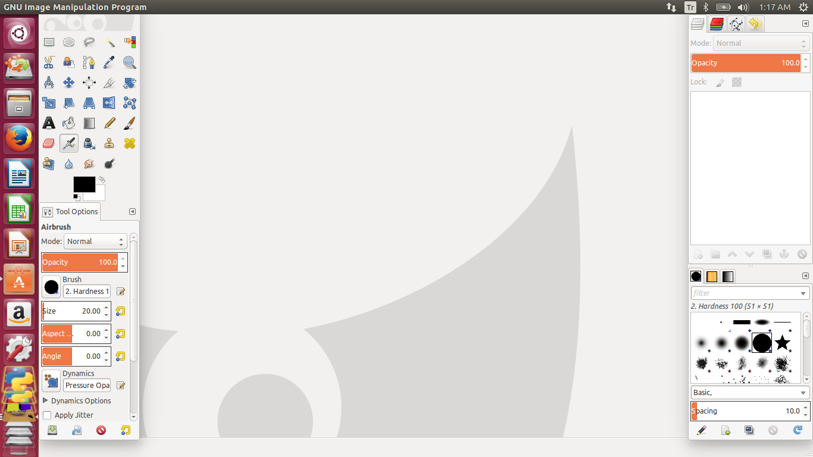

- Evveeet! 4. Sıradaki programımız Phyton IDLE. Phyton 2 ve 3 için ayrı
  versiyonları mevcut. Linuxun anadillerinden biri olan Phyton'da kod yazmak
  için sayısız IDE seçeneğinizden biri. Basitliğiyle beni cezbetti. Programı
  açmışken de bir "Hello World" yazmamak olmaz dedim, yazdım.

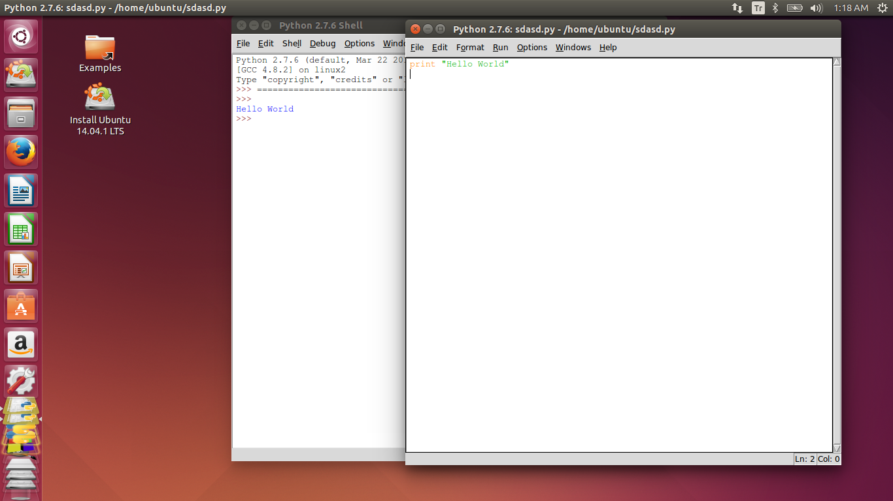

- Programımız Libre Office. Bu program Microsoft Office alternatifi olarak
  düşünülmüş. Onun dosyalarını açabiliyor, değiştirebiliyor. Nerdeyse tüm Office
  dosya türlerini destekliyor.

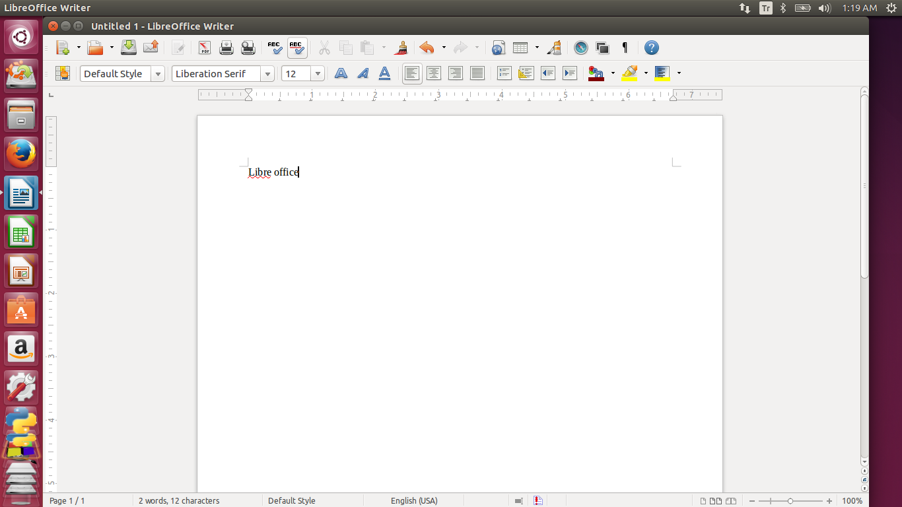]

- Programımız gerçekten bedava alternatifleri arasında en iyi program. İsmi
  Blender. Bu programla 3D modelleme, animasyonlar, efektler yapabilirsiniz.
  Hatta mevcut oyun motoru ile kendi 3D oyununuzu yapabilirsiniz. Program
  gerçekten çok professyonel, modelleme, texturing, animasyon yapma konusunda
  çok başarılı. Başka platformların kullanıcısı olsanız bile denemenizi şiddetle
  tavsiye ediyorum.

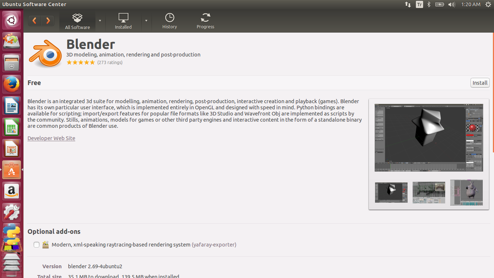

- Arduino, Open Source camiasının en popüler platformlarından biri. Arduinoyu
  bilmeyenler için anlatayım. Hobi elektronikçileri için üretilmiş mikro
  denetleyici kartı. Oldukça popüler ve çok çeşitli uygulamaları mevcut. Bu
  program ise o karta kod yazmaya ve derleyip yüklemeye yarıyor. Java tabanlı
  bir program olduğu için Linux'ta sorunsuz çalışıyor.

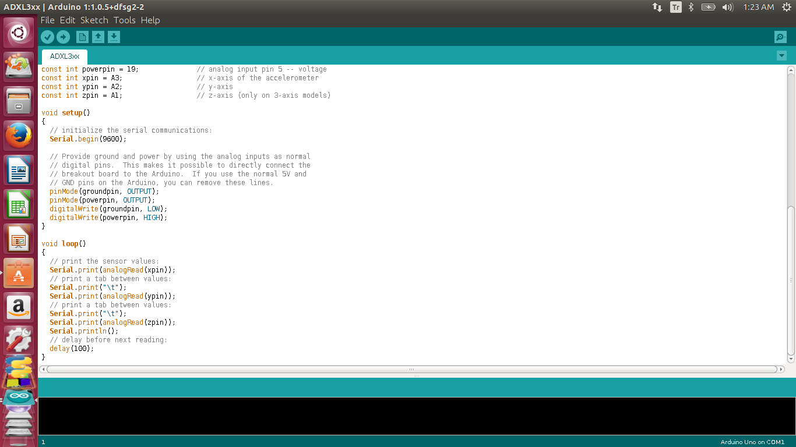

- Vlc player medya dosyaları oynatmada (her türlü video ve ses dosyası)
  Windows'ta olduğu gibi Ubuntu'da da yanımızda.

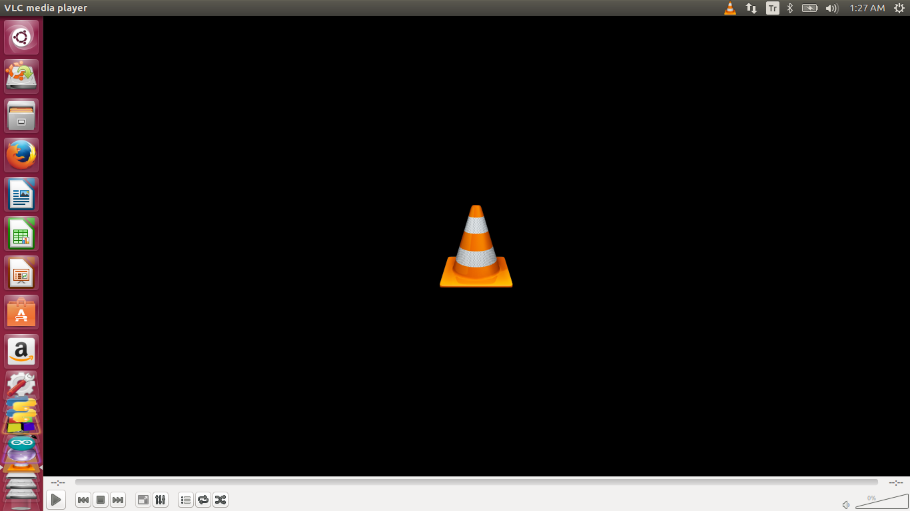

- 9.Programımız Ubuntu terminal programı. Linux tabanlı işletim sistemlerinde
  aslında çoğu iş terminalden yapılıyor. Ubuntuda bu biraz azaltılmış fakat yine
  de oldukça lazım olan bir program zaten dahili olarak bulunuyor. Bir çok işlem
  buradan yürütülüyor. Mesela aşağıdaki kodda ben ekran görüntüsünü almıştım.

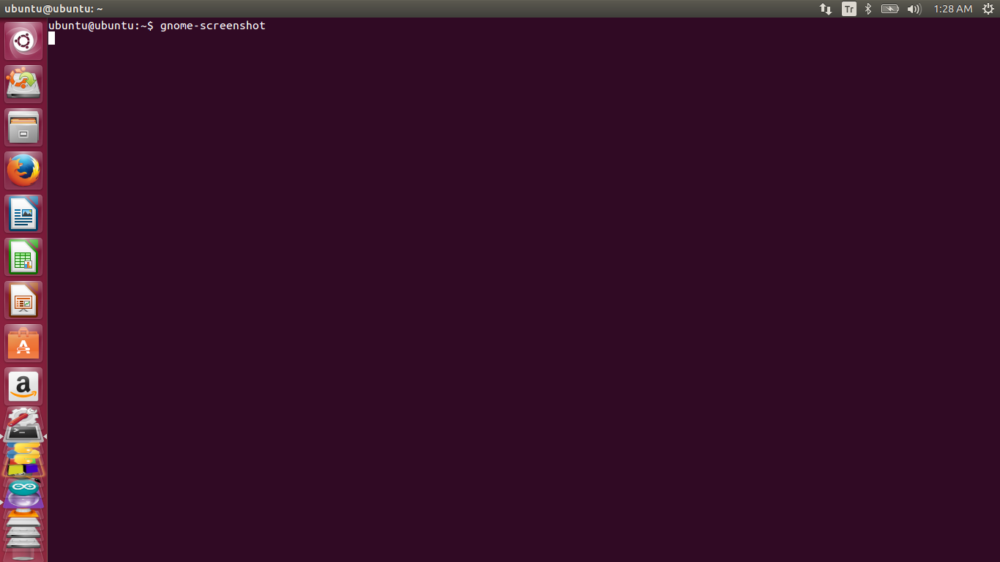

- Ve son programımız, Eclipse. Bu program açık kaynak kodlu bir IDE. Bir çok
  programlama dilini destekliyor. En çok Java dilinde program geliştirmek için
  kullanılıyor. Oldukça kullanışlı ve güçlü bir yazılım geliştirme aracı son
  olarak, bunu da tavsiye ediyorum. Tekrar görüşmek üzeree...

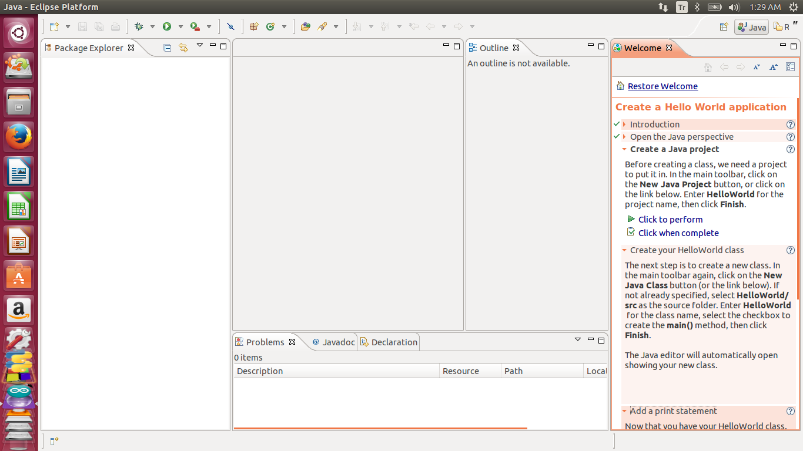

Not: Bu arada geçen yazımda Flash belleğe ubuntu kurmaktan bahsetmiştim fakat o
şekilde kurduktan sonra Türkçe klavye ayarlamasını manuel yapmak gerekiyor. Ben
de bu eksik olmuş gibi hissettim.Anlatayım o zaman;\
İlk önce En yazan yere tıklayıp oradan "Text Entry" seçiyoruz. Daha sonra +
tuşuna basıp kullandığımız klavyeyi "Add" tuşu ile ekliyoruz.

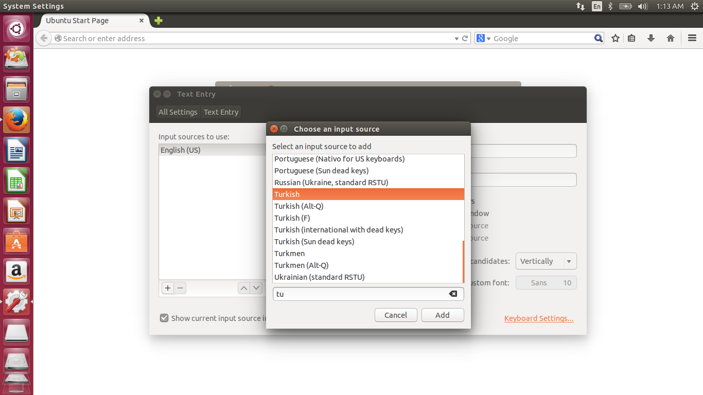
Yine aynı yere tıklayarak En ile Tr'yi değiştiriyoruz böylece klavye girişimiz
Türkçe klavye olmuş oluyor.

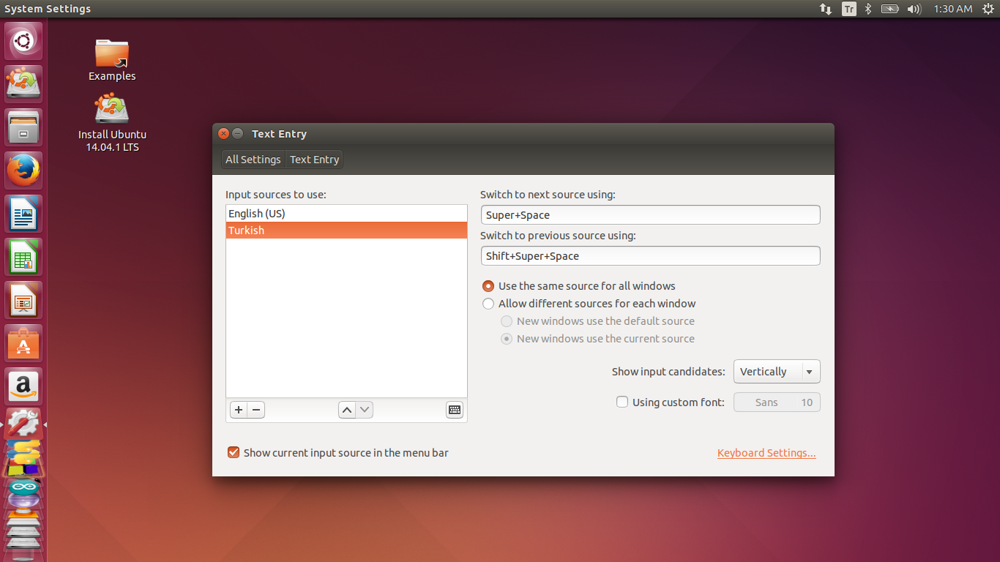

Masaüstümüzün son hali böyle oluyor. Güle güle kullanın.

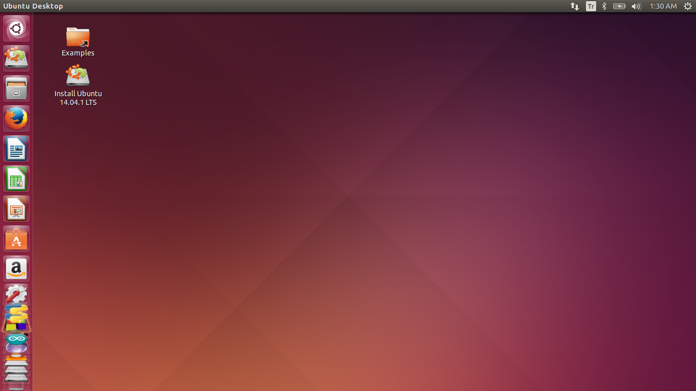
