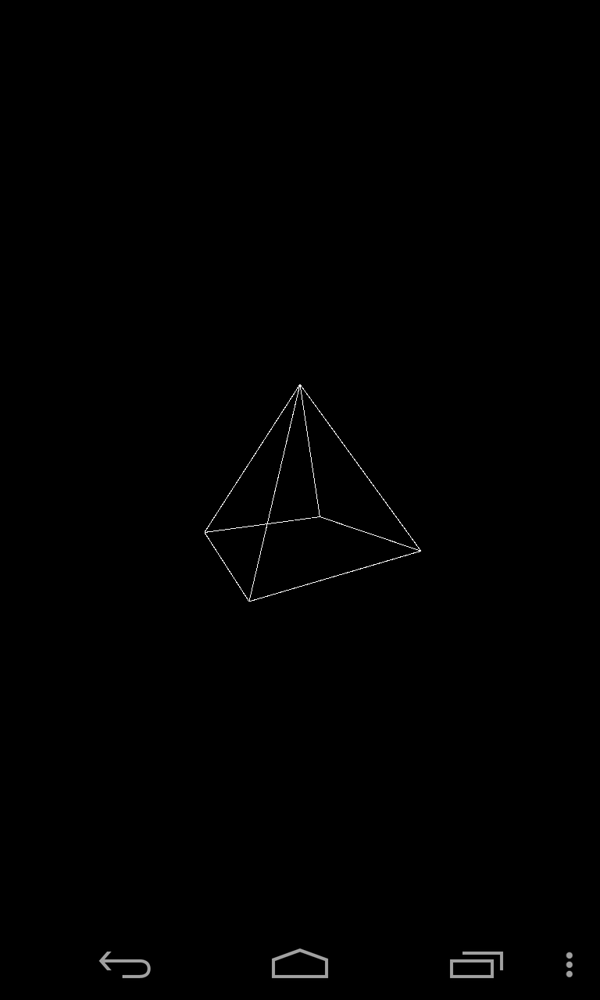

**Herkese Merhabalar!**

Processing dili son yıllarda Arduino ile popülerleşmeye başlayan görsel
programlama dilidir. Hızlı prototipleme için geliştirilmiştir Arduinoya görsel
arayüz hazırlama için sıklıkla kullanılmaktadır. Processing Windows, Linux,
Android, Mac her platformda çalışmaktadır. Kendi program geliştirme arayüzü
bulunmaktadır. Bu programlama diliyle kolay bir şekilde 2D, 3D görsel
uygulamalar yapılabilir.

Ben bugünkü yazımda nasıl Android telefonda Android için nasıl Processing
diliyle görsel uygulama yapılacağını anlatacağım. Öncelikle Google Playden
uygulama geliştirmek için gerekli IDE'yi(geliştirme ortamını) indiriyoruz. Bir
çok çeşit geliştirme ortamı var fakat ben APDE uygulamasını tercih ettim. Bu
uygulama ile processing kodu yazıp onu derleyip telefon üzerinde
deneyebiliyoruz.

APDE programını Android telefonumuza indirip kuruyoruz.

Program kurulunca açıp sağ üst köşedeki butondan "new sketch" seçebilirsiniz.
Yeni bir sketch açtıktan sonra aşağıdaki fonksiyonları yazabilirsiniz. Bu
fonksiyonlar Processing dilinin temel fonksiyonları ve her sketchte var olur.
Ayarla alakalı kodlar "setup" kısmına, her zaman dönecek kodlar ise "draw"
kısmına yazılır.

İlk uygulamamızı yazmaya hazırız. İlk önce setup kısmında pencere büyüklüğümüzü
ayarladık. Draw kısmına ise sürekli dönecek kodu yazıyoruz. Bu kodda
dokunduğumuz yere bir elips çizmesini istemiş oluyoruz. 

Çalıştırma tuşuna basıyoruz. 

Programımızı bir .apk dosyası haline getirip telefonumuza yükleyecek.

İlk programımızdan görüntüler.

   Processing ile 3  boyutlu uygulama yapmak da mümkün, aşağıda bir küp çizmek
için gerekli kodu görebilirsiniz. Ayrıca camera değişkenlerini mouseX ve mouseY
değerlerine atayarak dokunmatik ekrana dokunma ile küpü görüş açısı
değiştirilir.

Daha karmaşık şekilleri çizmek için ise vertex ile çizim gibi yöntemler
kullanılır. Processing dili Opengl destekli olduğu için çoğu opengl fonksiyonu
kullanılabilir. Oldukça güçlü olan bu kütüphane ile sayısız ve karmaşık bir çok
görsel uygulama yapılabilir.

