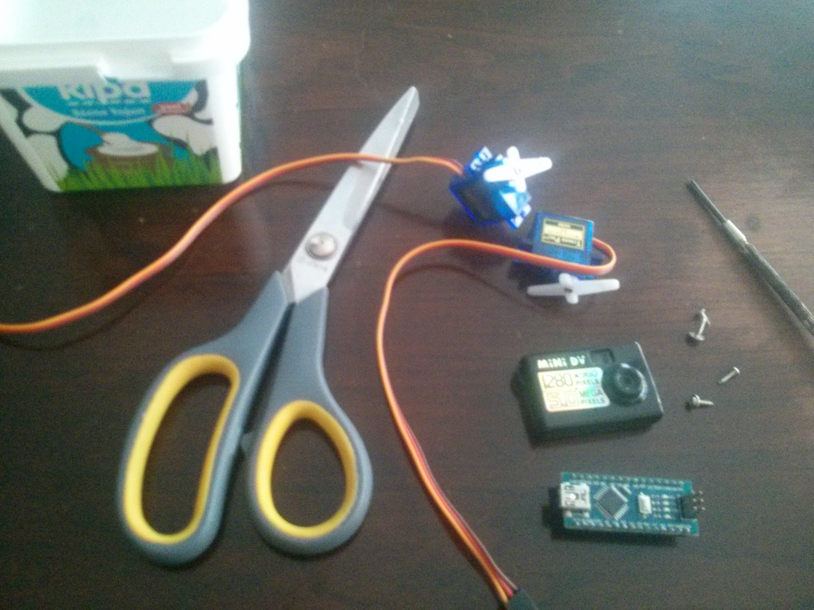
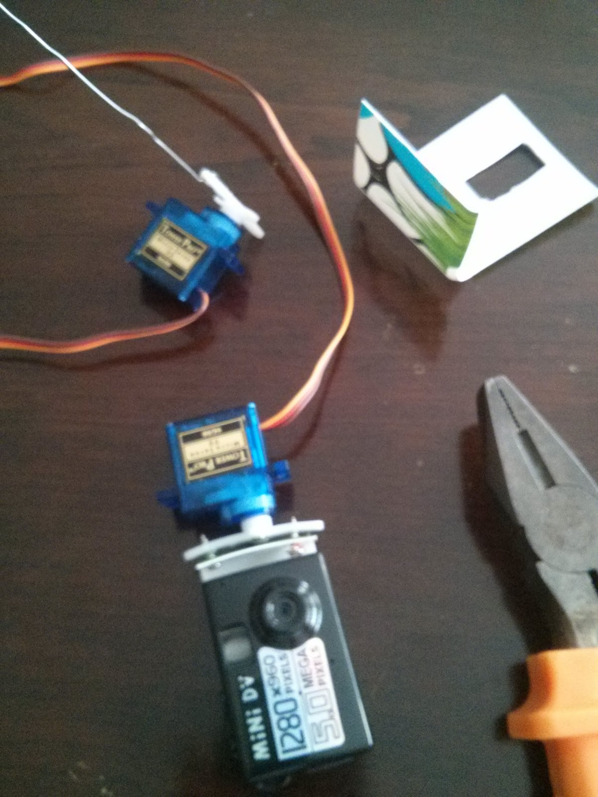
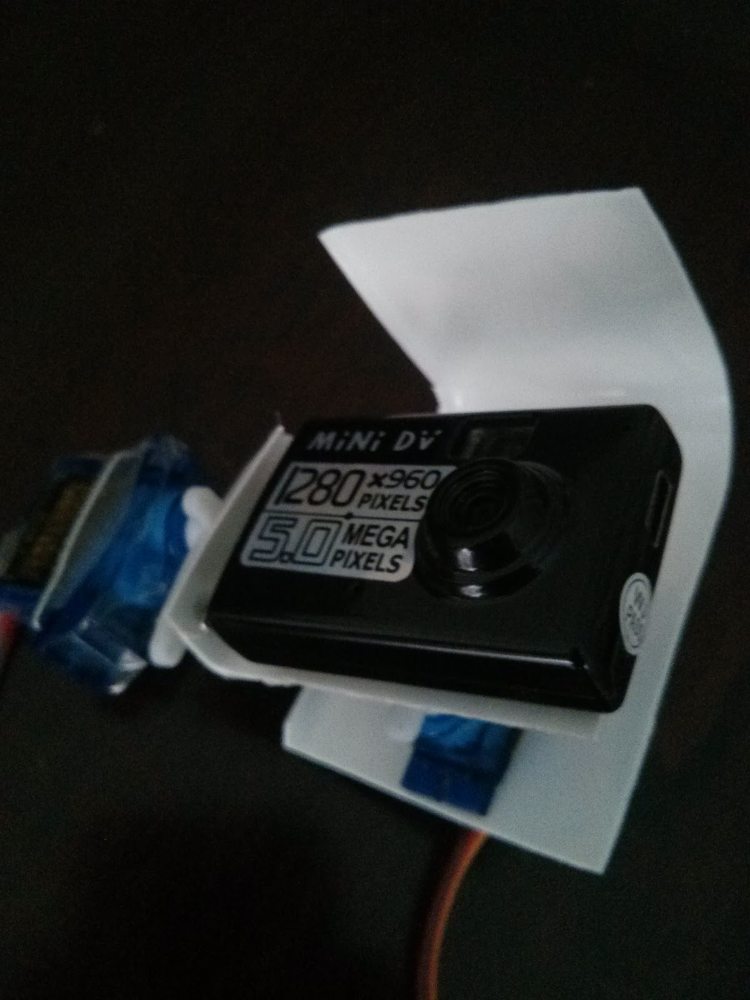
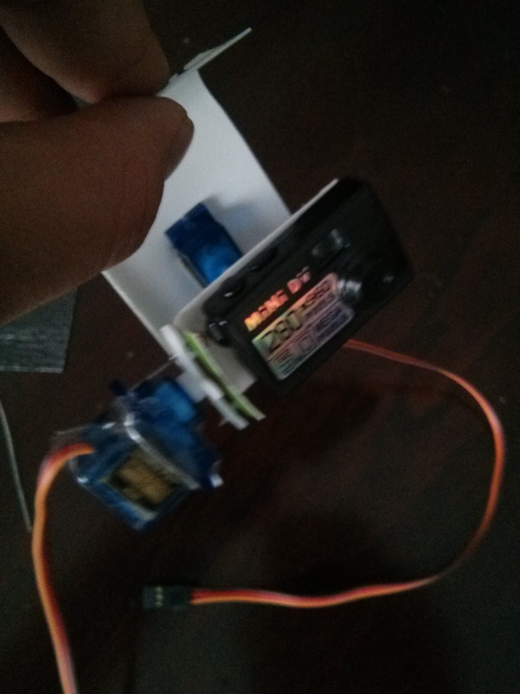

**Herkese Merhabalar,**\
Bu yazımda her yerde temin edilebilecek ve maliyetsiz malzemelerle nasıl mini
servo gimbal yapılacağını anlatacağım. Bu arada en baştan belirteyim kontrol
kartı ve açı stabilizasyonu için daha sonra bir yazı hazırlayacağım.

Proje içi kullandığım malzemeler 2 adet servo, Arduino Nano, mini kamera, yoğurt
kabı, ve ataç. Gimbalin yapım aşamaları resimlerde sırasıyla anlatılmıştır.
Özetlemek gerekirse;

1. Yoğurt kabından bir köşe 2 kenarıyla beraber çıkarılır.
2. Servolardan bir tanesi için oyuk açılır ve servo oraya vidalanır.
3. Bu servonun koluna ataç vidalanır.
4. Ataç 90 derece büküldükten sonra diğer servo biraz da bant yardımıyla
   sabitlenir.
5. Burada dikkat etmemiz gereken servoların dönme eksenlerinin kameranın ağırlık
   merkezinden geçmesidir. Bu sayede servolara binen yükük minimuma düşer.
6. Kamera için yapılan kap vida yardımıyla 2\. servonun koluna sabitlenir.
7. Ve son neredeyse hiç maliyetli 2 eksen gimbal yapmış olduk. Biraz titreşim
   problemi olacaktır diye tahmin ediyorum. Daha az esnek malzemeler
   kullanılarak bu sorun aşılabilir. 

](IMG_20150605_163841.jpg)

](IMG_20150605_184307.jpg)

](IMG_20150605_192448.jpg)

](IMG_20150605_192500.jpg)

Gimbalin servo deneme videosu. Kontrol kartı ve açı stabilizasyonuyla alakalı
bir yazı en kısa zamanda yayınlayacağım. Tekrar görüşmek üzere.


