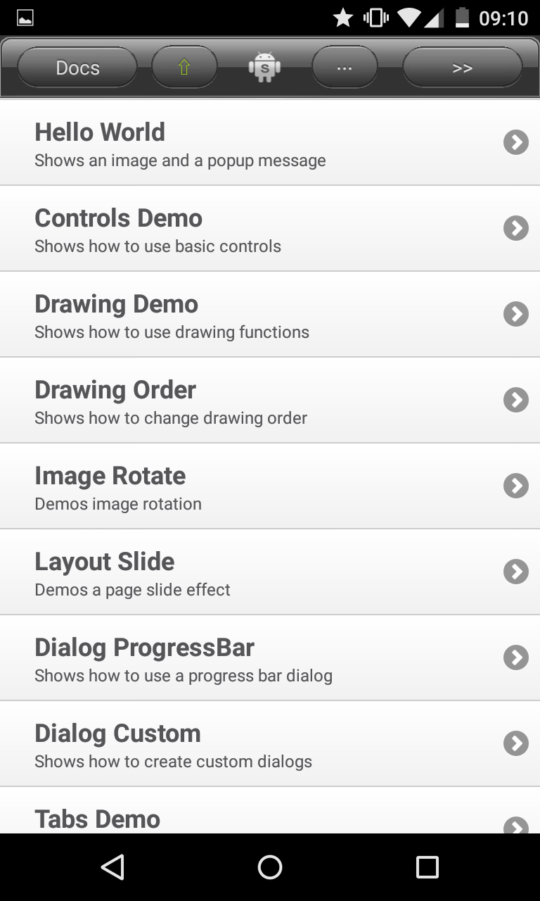
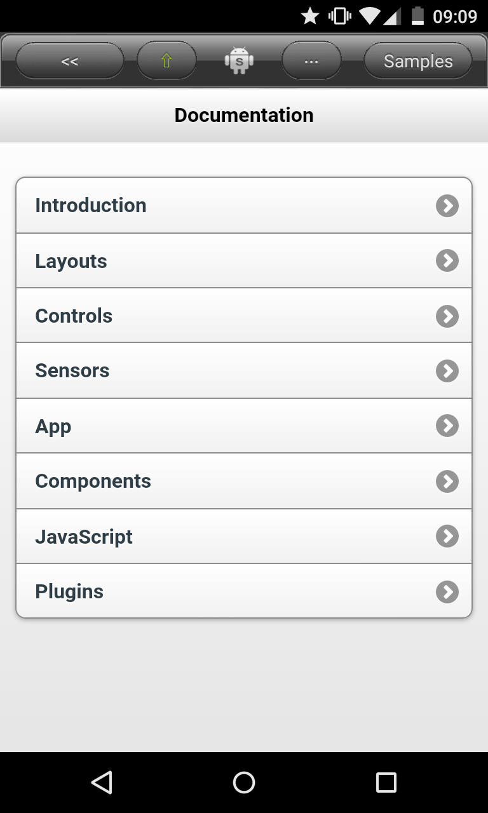
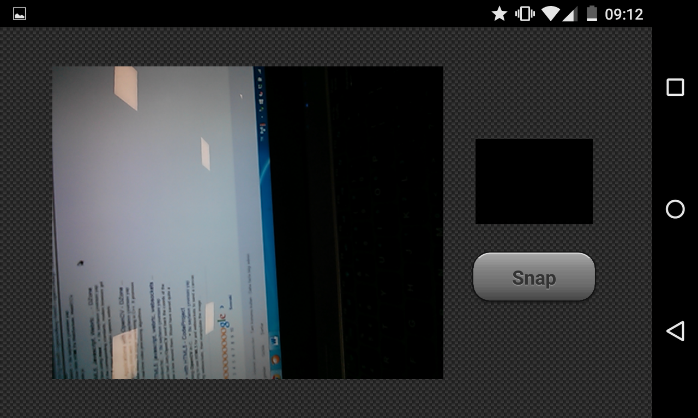
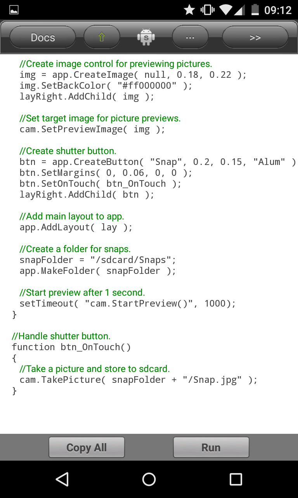
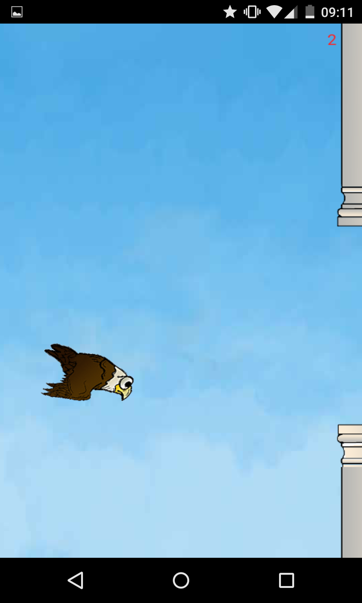
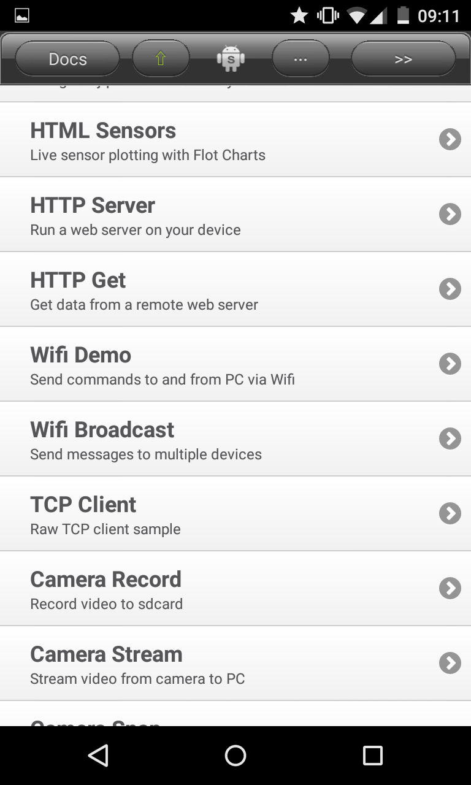
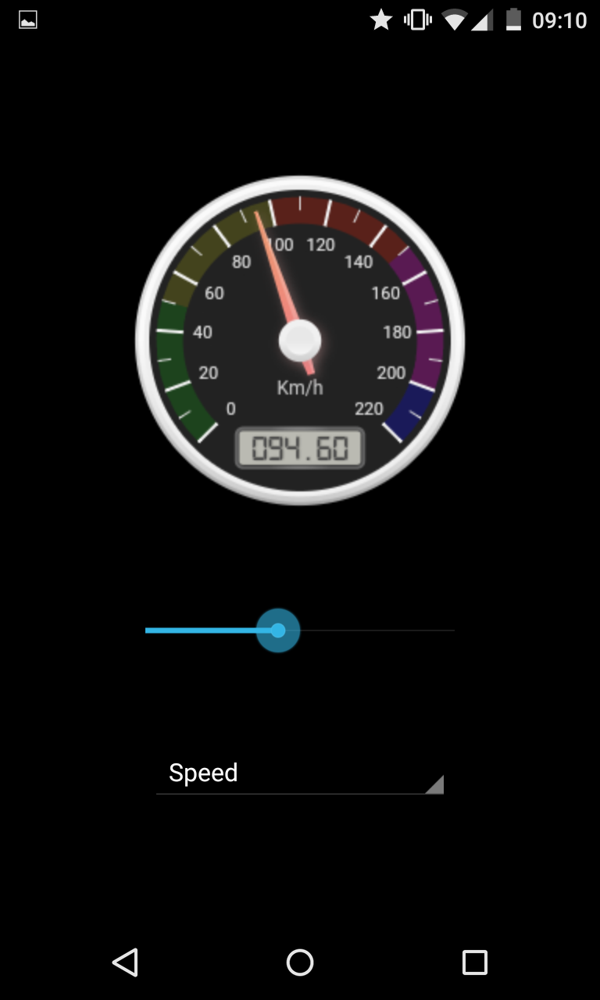
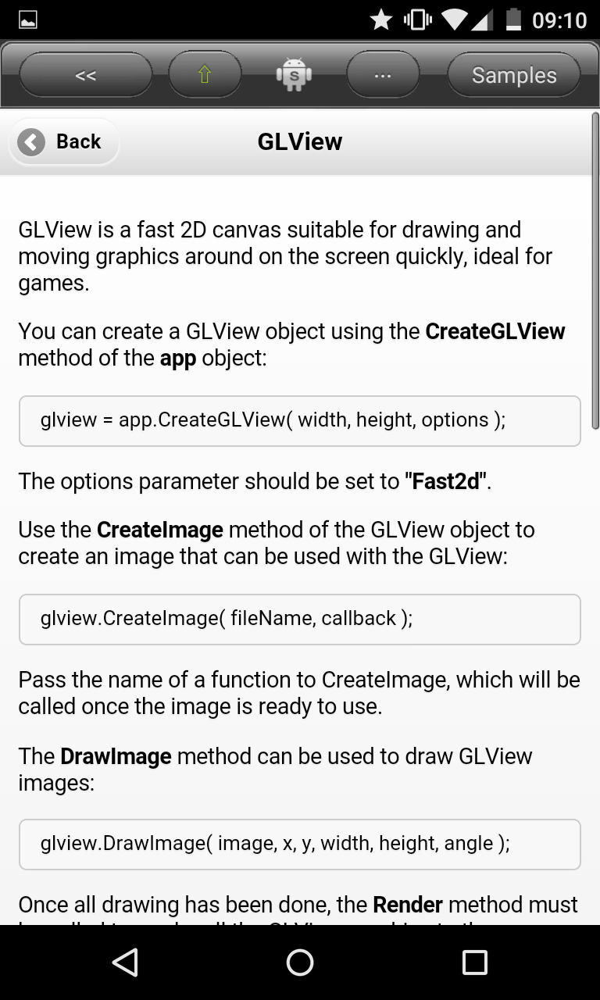
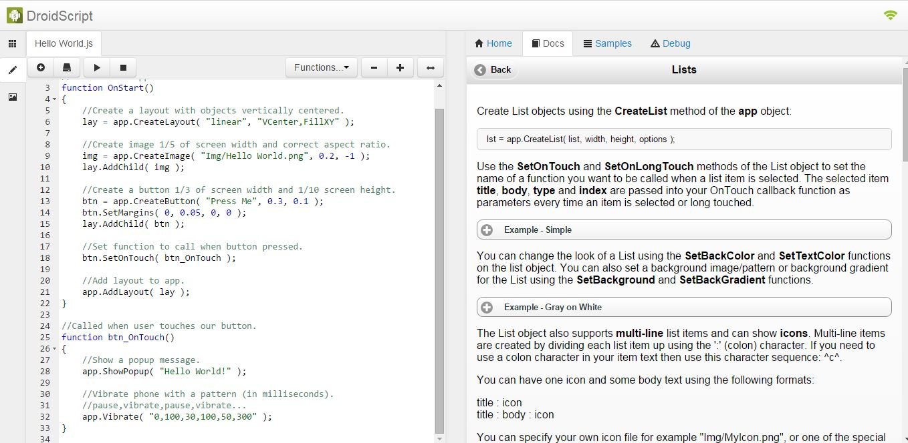

**Herkese Merhabalar,**\
      Bugün size bir android uygulaması olan Droid Script uygulamasından
bahsetmek istiyorum.
[Programa burayı tıklayarak ulaşabilirsiniz](https://play.google.com/store/apps/details?id=com.smartphoneremote.androidscriptfree).
Bu uygulama bana göre en iyi android uygulamasıdır. Droid Script java script
tabanlı Android uygulama geliştirme uygulamasıdır. Bu program sayesinde android
üzerinde android için kolayca uygulama geliştirebilirsiniz. Bunu yapabileceğiniz
farklı uygulamalar bulabilmeniz mümkün. Droid Script ayıran özellikler ise şöyle
sıralayabiliriz:

- Çok gelişmiş program içi dokümantasyon (Programdan hiç çıkmadan dokümantasyon
  bölümünden bakarak uygulamalarınızı geliştirebilirsiniz )
- Telefon donanımına kolay ulaşım (Gps, kamera, sensörler, bluetooth)
- Çok geniş örnek uygulama havuzu (Aklınıza gelebilecek her şeyin örneği var ve
  yine program içinden ulaşabiliyorsunuz.)
- Jqplot Canvgauge gibi Java Script kütüphanelerini uygulamalarınızda gömülü
  olarak kullanabilirsiniz.( Gerçek zamanlı sensör grafikleri çizdirebilir,
  çeşitli Gauge ekleyebilirsiniz.)
- Google Speech Recognition ve Google Text to Speech desteği
- WebGL sayesinde yüksek performanslı yüksek görsellikte oyun tasarımı
- Veri tabanı oluşturabilirsiniz.
- Web browser ve TCP UDP gibi network programlama desteği.
- Eğer telefon üzerinden geliştirmek istemiyorsanız Wifi aracılığıyla
  bilgisayarınızdaki browser üzerinden doğrudan bilgisayarınızda programınızı
  geliştirip tek tuş ile telefonunuzda deneyebilirsiniz.

Kısacası, Android programlama asıl odaklandığınız nokta değilse fakat
projelerinizde Android kullanmak istiyorsanız Droid Script tam aradığınız
program. Fazla zaman ayırmadan istediğiniz uygulamayı geliştirmeniz mümkün.

Örnekler

Dokümentasyonu

Kamera örnek uygulama

Android içindeki geliştirme ortamı

WebGL ile yapılmış Flappy Bird tarzı oyun

Network uygulama örnekleri

CanvGauge Kütüphanesi Kullanımı

Dokümantasyonun içinden

Browser tabanlı geliştirme ortamı

