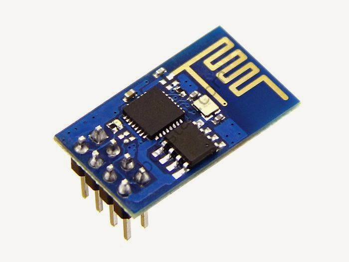
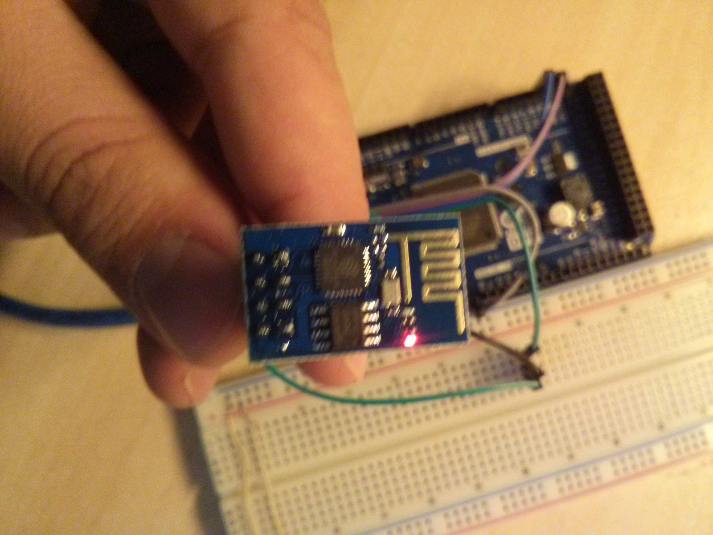
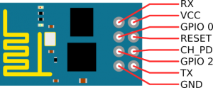
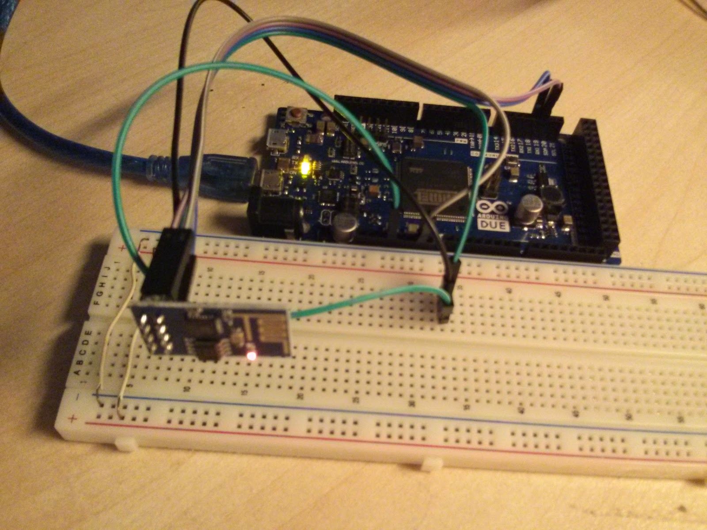
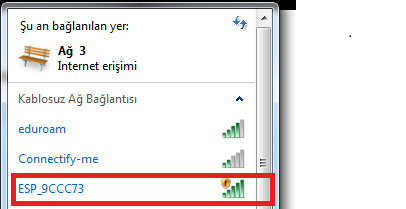
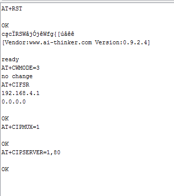
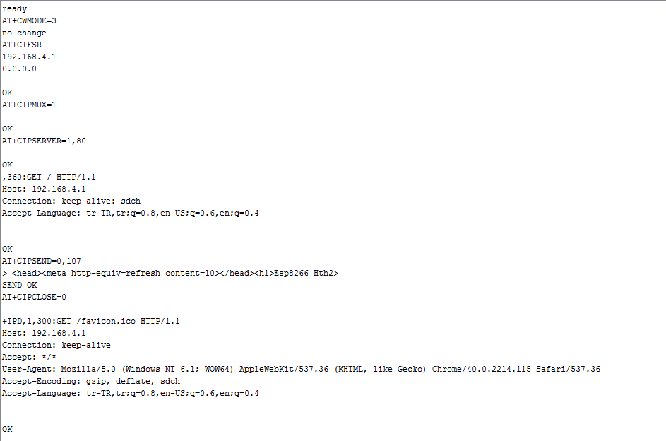
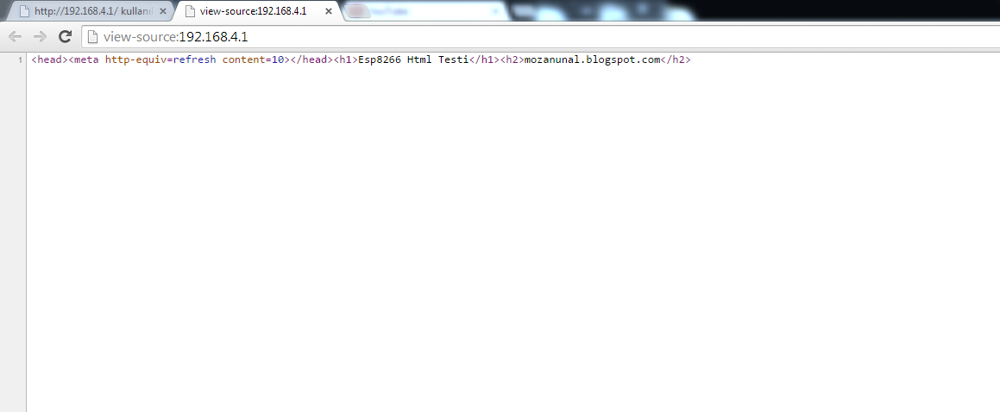

**Merhaba arkadaşlar,**

Bugünkü yazımda ESP8266 modüllerinden bahsetmek istiyorum. Bu modül seri port
üzerinden haberleşen wifi modülü. Fiyatı yaklaşık 5 $ özelliklerini gördüğünüz
fiyatından çok daha fazlasını hakkettiğini göreceksiniz. Özelliklerine geçecek
olursak;

- 802.11 b/g/n desteği

- Wi-Fi Direct (P2P) Desteği

- Dahili TCP/IP protokol yığını

- +19,5dBm çıkış gücü (802.11b modunda)

- Kaçak akım < 10uA

- Dahili düşük güç tüketimine sahip 32-bit'lik işlemci

- SDIO 1.1/2.0, SPI ve UART desteği

- STBC, 1x1 MIMO, 2x1 MIMO

- Uyanma ve veri paketi alma süresi < 2ms

- Stand-by durumunda güç tüketimi < 1mW



Modülümüz yaygın tüm wifi protokollerini destekliyor, yerel ağdan ve internet
üzerinden yapabileceğimiz binlerce çeşit uygulama için oldukça elverişli.
Üzerinde 32 bitlik işlemci mevcut. 19.5 dBm çıkış gücüne sahip, full güç ile
çalıştırılırsa antensiz 400 metreden fazla antenli ise 4km'den fazla uzaklıktan
sinyal alınabildiği test edilmiş bu fiyat ve bu boyutta bir modül için rakamlar
çok iyi.[Buradan ](https://www.youtube.com/watch?v=7BYdZ_24yg0) mesafe testi
videosunu izleyebilirsiniz. Boyut konusuna gelecek olursak boyutları 2.1 cmX 1.3
cm, üzerinde dahili PCB anten bulunuyor.



**Internet of Things**

Esp8266'nın özellikleri böyle fakat biz ne için kullanacağız. 1999 yılında
ortaya atılan son yıllarda ise popülerleşen bir kavram var, "Internet of Things"
yani Türkçesi" Nesnelerin İnterneti" kavramı, insanlar dışında diğer eşyaların
da (buz dolabı, ocak, klima, evin kapısı...) bir iletişim ağına sahip olup,
birbiriyle haberleşmesi. İşte bu küçük wifi modülleri bu noktada devreye
giriyor. Kullanımları basit, düşük maliyetli, enerji tüketimleri düzenlenebilir
olan bu modüller, kolayca herhangi bir eşyamızı "Online" hale getirebilir,
bilgisayar telefon gibi herhangi bir ağa bağlanabilen aletlerle kontrol edebilen
şeylere dönüştürebilir. "Online" eşyalarımızı haberleştirerek daha akıllı, daha
efektif hale getirebilir.Aynı zamanda hali hazırda var olan wifi ağlarını
kullanmaları modullerin entegre edilebilirliğini artırıyor.

Bu yazıda Esp8266 modülünün kullanımına sadece bir giriş yapacağız, modülümüzle
HTML sayfası oluşturup, bilgisayarımızdan bağlanacağız. Modülümüzün kullanımına
gelecek olursak pin dizilimi aşağıdaki gibidir.



Bizim yapacağımız bağlantılar ise şu şekilde olmalıdır.

VCC---> Arduino 3.3 V

GND---> Arduino GND

RX----->Serial 1 TX

TX----->Serial 1 RX

CH_PD> Arduino 3.3 V



> Önemli Uyarı: Bu modül 3.3 volt ile çalışmaktadır ve
rx tx pini de 5 volta dayanıklı değildir. Ben bu projede Arduino DUE kullandığım
için problem yaşamadım fakat diğer Arduino modellerinin 5 voltlukları
kullanılacağı zaman level shifter entegrelerine ihtiyaç duyulur.

Arduino kodu aşağıdadır eğer başka bir Arduino ile kullanacaksanız "Serial1"
yerine "SoftwareSerial" kullanmanızı öneririm.

```cpp
#include <Wire.h>
#define DEBUG true

void setup()
{
  Serial.begin(9600);// Arduino-Pc haberleşmesi Debug için kullanacağım
  Serial1.begin(9600); // Arduinoyu Esp8266 bağladığımız serial port

  sendData("AT+RST\r\n",2000,DEBUG); // reset
  sendData("AT+CWMODE=3\r\n",1000,DEBUG); //  MOde olarak access point seçilir
  sendData("AT+CIFSR\r\n",1000,DEBUG); // Modulün ip adresi alınır
  sendData("AT+CIPMUX=1\r\n",1000,DEBUG); // birden fazla bağlantıya izin ver
  sendData("AT+CIPSERVER=1,80\r\n",1000,DEBUG); // Port= 80 yapılır
}
int sayi=0;

void loop()
{
  if(Serial1.available())
  {
    if(Serial1.find("+IPD,"))
    {
      delay(300);
      int connectionId = Serial1.read()-48; // 48 çıkarılır çünkü char to int fönüşümü yapmamız gerek
                                           // ASCCI table da 0 sayısı 48 ile ifade edilir yani:
                                           // '0' - 48 = 0
                                           // '1' - 48 = 1

     String webpage = "<head><meta http-equiv=""refresh"" content=""10""></head>";
     webpage+="<h1>Esp8266 Html Testi</h1><h2>";
     webpage+= "mozanunal.com";
     webpage+="</h2>";

     String cipSend = "AT+CIPSEND=";
     cipSend += connectionId;
     cipSend += ",";
     cipSend +=webpage.length();
     cipSend +="\r\n";

     sendData(cipSend,1000,DEBUG);
     sendData(webpage,1000,DEBUG);

     String closeCommand = "AT+CIPCLOSE=";
     closeCommand+=connectionId;
     closeCommand+="\r\n";

     sendData(closeCommand,3000,DEBUG);
    }
  }
}

String sendData(String command, const int timeout, boolean debug)
{
    String response = "";

    Serial1.print(command); // send the read character to the esp8266

    long int time = millis();

    while( (time+timeout) > millis())
    {
      while(Serial1.available())
      {

        // The esp has data so display its output to the serial window
        char c = Serial1.read(); // read the next character.
        response+=c;
      }
    }

    if(debug)
    {
      Serial.print(response);
    }

    return response;
}
```

Esp8266yı Acces Point olarak kullanıyoruz. Yani bizim için wifi ağı kurar kodu
yükledikten sonra ağa bağlanın.



Serial porttan gelen veriler bu şekilde olmalıdır. Problem yaşadığımızda buradan
kontrol edip DEBUG yapabiliriz.





Programımızın çıktısı bu şekilde olacaktır.


String halinde Arduino'ya yüklediğimiz HTML dosyasını modül wifi ağında
paylaşır.


