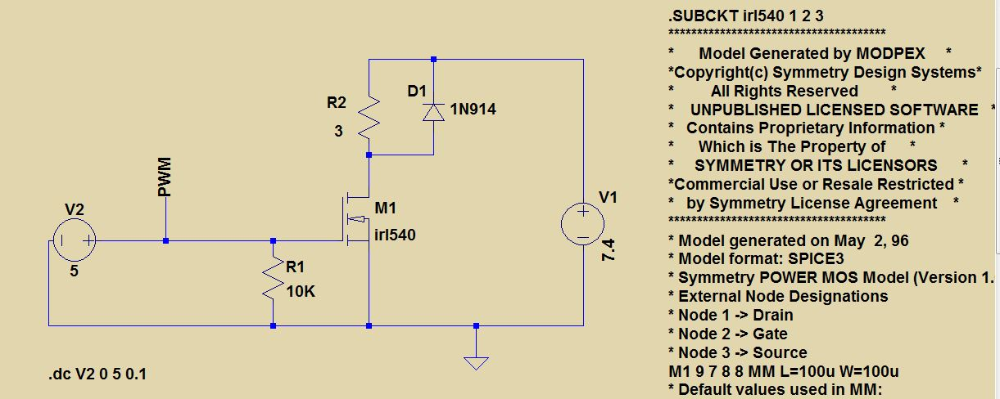
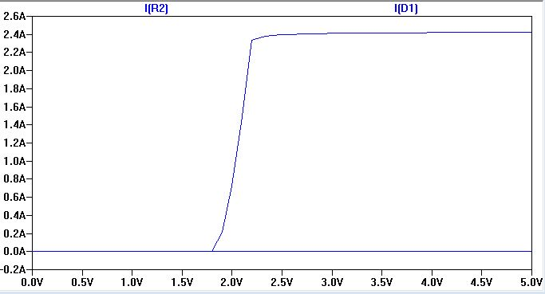
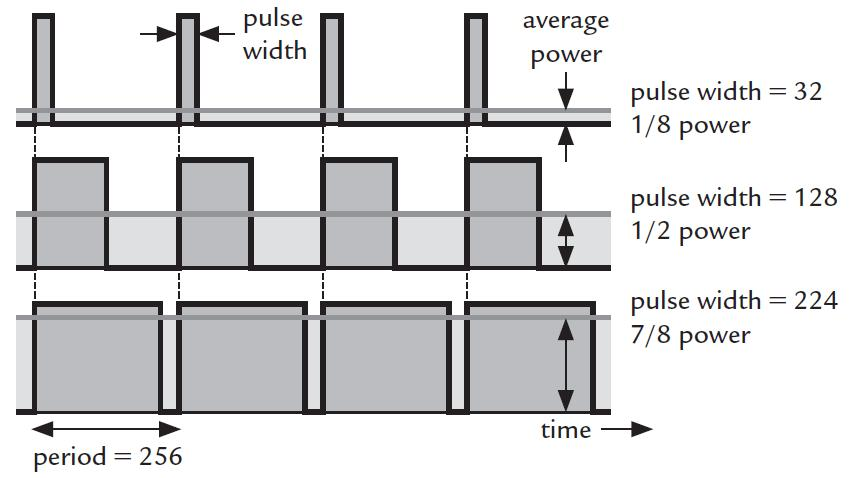

**Herkese Merhabalar,**

Yapacağım bir proje için fırçalı bir motorun Arduino ile hızını kontrol etmem
gerekiyordu. Bunun için elimdeki fırçalı motor için elektronik hız kontrolü yani
ESC (Electronic Speed Control) yapmaya karar verdim.

Öncellikle kendi motorumun ve devrelerimin besleme gerilimi yazayım. Çünkü devre
bu özelliklere göre dizayn edilecektir. Siz de kendi malzemelerinize ve
voltajlarınıza göre kendi devrenizi dizayn edebilirsiniz. Benim elimdeki motoru
besleme voltajım 7.4 volt ve motorun çektiği maximum akım 2 amperdir. Hız
kontrolü için göndereceğim PWM sinyalinin genliği de (Arduinonun çalışma
voltajı) 5 volttur. Bu şartlar altında devremi bir power mosfet ile tasarlamaya
karar verdim. Mosfette var olması gereken özellikler 5 volt anahtarlamaya uygun
rds ve Vgs özelliklerine sahip olması, üzerinden 2 amper akım rahatça
geçebilmesidir. Bu nedenlerden dolayı ben IRL540N mosfetini seçtim. Kendisi bir
logic mosfet bu sayede 5 volt gibi düşük bir Vgs voltajı ile devreyi
anahtarlayabiliyor. Ayıca üzerinden 28 amper sıkıntısız geçebiliyor. Bu
özellikleriyle projemiz için oldukça
uygun. [Datasheetine buradan ulaşabilirsiniz.](https://www.irf.com/product-info/datasheets/data/irl540n.pdf)

Uygun mosfeti seçmek için LTSpice programı üzerinden simülasyon yapmam gerekti
aşağıdan simülasyon devresi ve elde ettiğim grafikleri inceleyebilirsiniz.

Şekildeki devrede V2 voltajı, arduinodan mosfeti sürmek için uygulanacak olan
voltajı temsil etmektedir. O voltaj aralığında düzgün çalışıp çalışmayacağını
anlamak için 0-5 volt aralığındaki bütün voltajlar uygulanarak yükümüz yani R2
üzerinden geçen akım takip edilmiştir. 2.2 volt ile rahatlıkla anahtarlama
yapılmaktadır.

Şekildeki gördüğümüz gibi PWM göndereceğimiz yerden 0 volt uygulandığında
motorun üzerinden geçen akım sıfıra yakın iken, 5 volt gönderildiğinde motorumuz
çalışıyor.

Motorun arduino pini üzerinden kontrolü bu şekilde, fakat PWM kavramına yabancı
iseniz hız kontrolünü nasıl yaptığımı anlamamış olabilirsiniz. PWM (Pulse Width
Modulation) ,yani Sinyal Genişlik Modülasyonu, belli bir frekansta ve faklı
genişliklerde bir dijital işarettir. Aşağıdaki şekilden inceleyebileceğiniz gibi
farklı genişliklerde PWM sinyalleri uygulanarak motorun hız kontrolü sağlanır.

Diyot mosfeti motorda indüklenecek ters akımdan dolayısıyla gerilimden kurtarmak
için oraya konulmuştur. Ve son olarak yaptığım devrenin gerçek hayata geçirilmiş
halini ve denenmesini aşağıda bulabilirsiniz. Tekrar görüşmek üzere...



