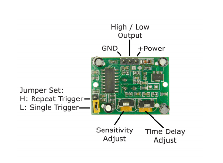
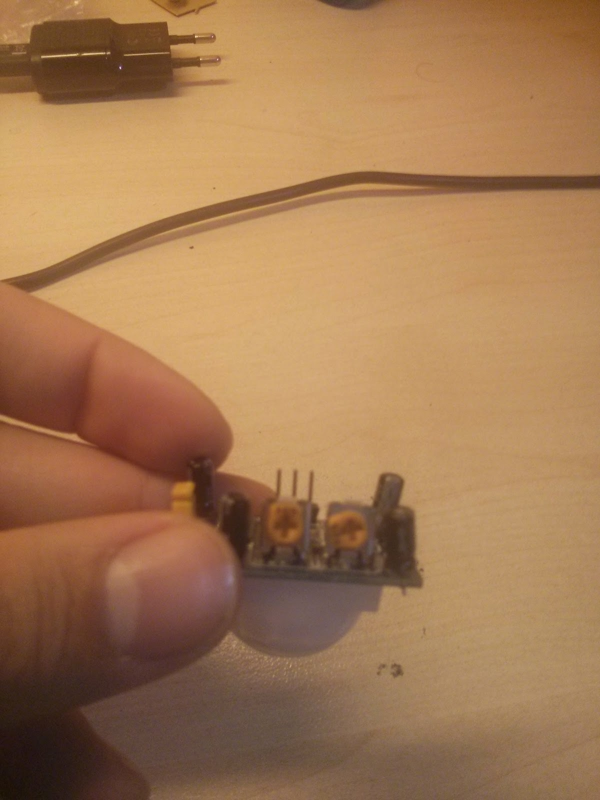
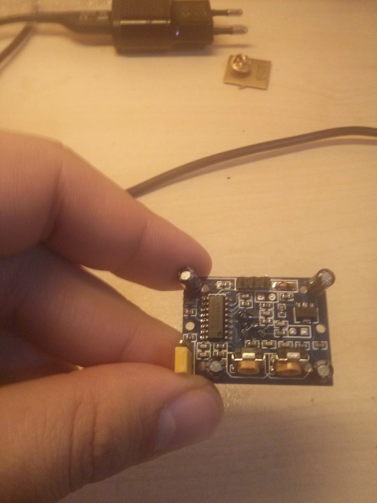
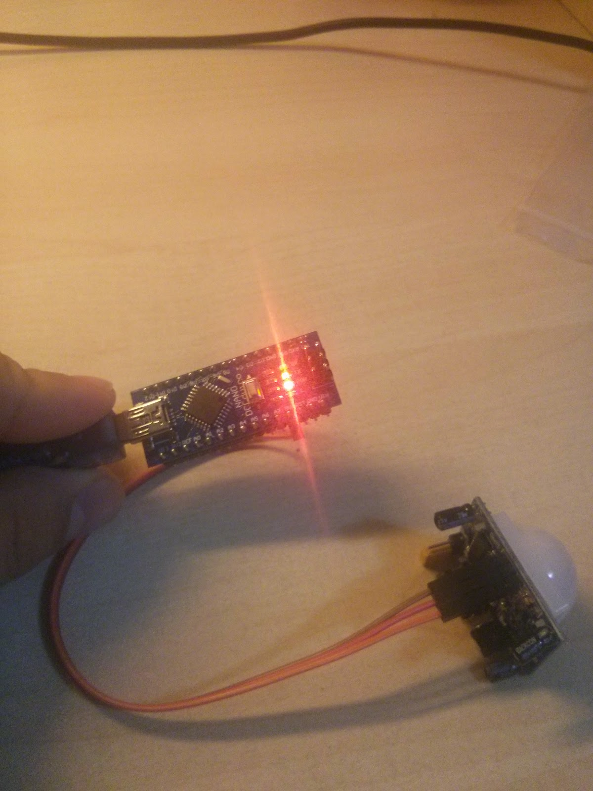
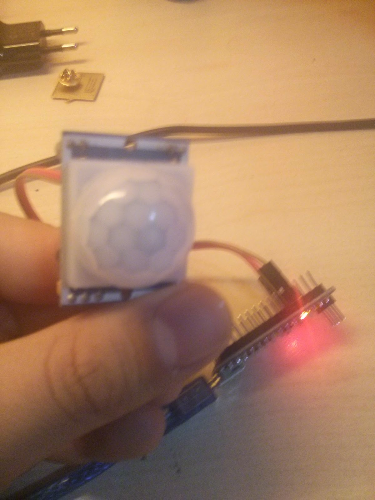

**Merhaba arkadaşlar,**\
Bugünkü yazımda bir PIR sensörü olan HC-SR501 inceleyeceğiz. PIR sensörünün
açılımı Passive Infrared Sensor. Son 4- 5 yılda çok hızlı bir yayılım gösterdi
bu sensörler ve insan algılayınca çalışan lambalar, otomatik el kurutma vb
makinalar olarak hayatımıza girdi. Modulumüzden bahsetmeden önce PIR sensör
nedir onu açıklamak istiyorum. PIR sensör ortamdaki kızılötesi ışınları ölçer.

Alıcılarda çok farklı yere doğru odaklanan frensel lensi bulunur bu sayede belli
bir alandaki tüm enerji ölçülmüş olur. Canlıların sıcaklığı ortalama 36 derece
civarlarında olduğundan merceğin üzerine düşen kızılötesi ışınların toplam
enerjisi y ir. Böylece canlı varlığı tespit edilmiş olur.

Gelelim modülümüze. Çalışma voltajı 3.6- 20 volt arasında. Resimde gösterilen
"Sensivity Adjust" tripotundan hassasiyet ayarlanıyor. Diğer trimpottan ise 0.5
-300 saniye ayarını yapabiliriz. Modül bir cisim algılayınca "Output" pininden
çıkış veriyor. Test etmek için bir Arduino kodu yazdım.Koddaki yaptığım tek şey
dijital veriyi okuyup ekrana seri port üzerinden bilgisayara yollatmak. Zaten
sadece lamba çalıştırmak için Arduino kullanmak gereksiz olur. Bir transistör
ile çıkış güçlendirilip röle sürmek daha mantıklı olacaktır.

Benim bilgileri aldığım modulün datasheet'i de burada.

https://www.mpja.com/download/31227sc.pdf

