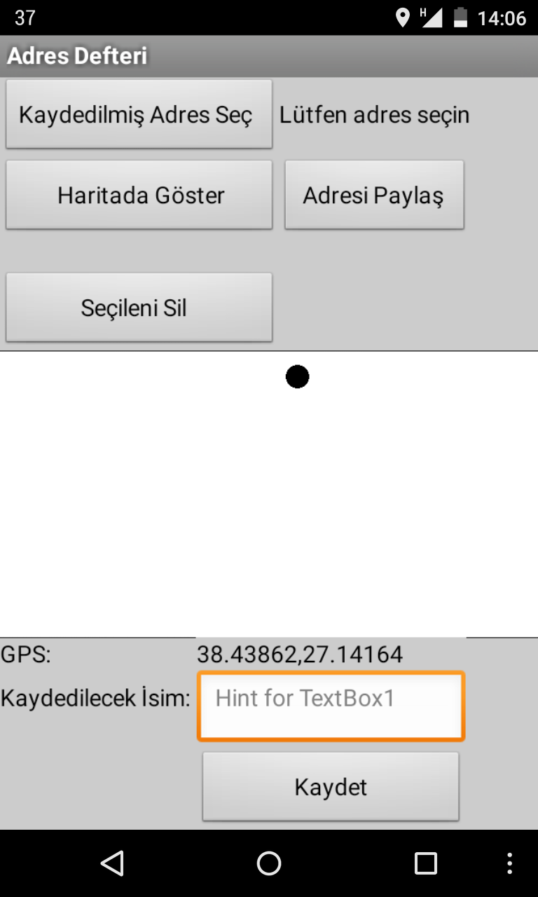
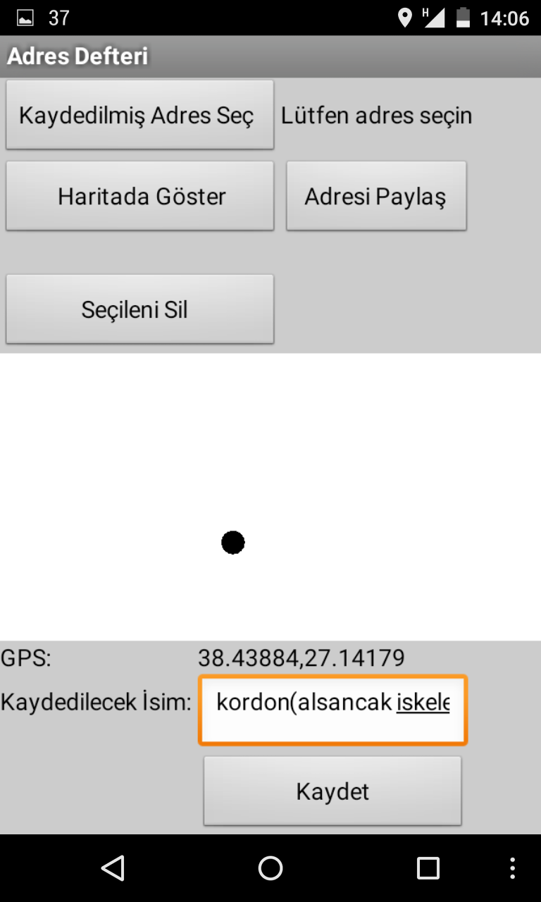
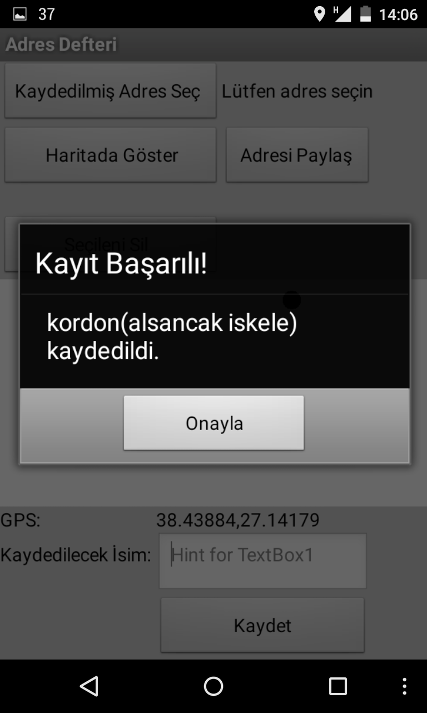
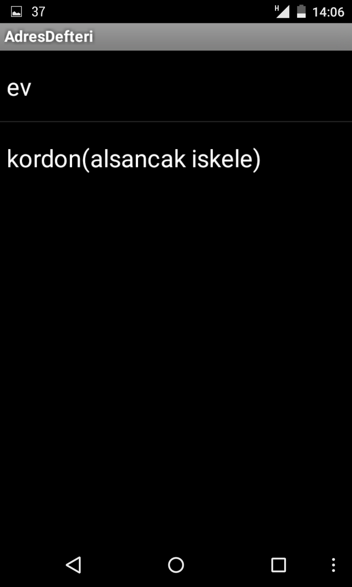
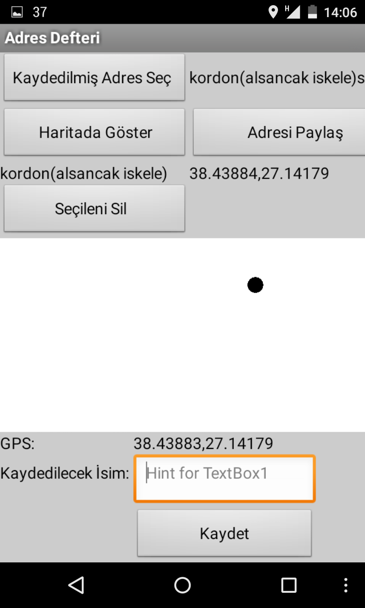
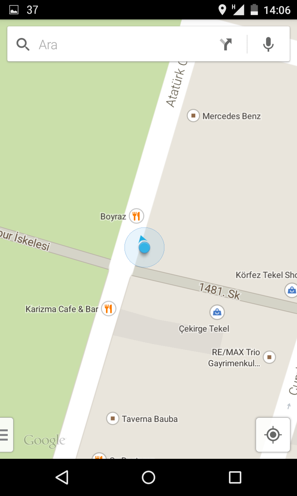
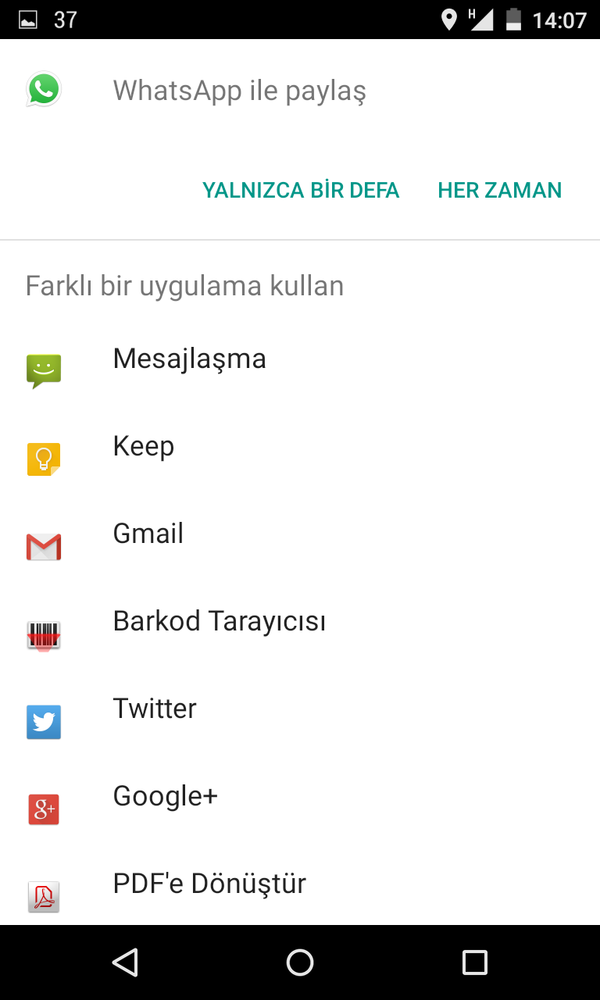

**Herkese Merhabalar!**

Bu yazımda yaptığım Android programı sizlerle paylaşmak istiyorum. Programımın
adı Adres Defteri, Size gerekli olan adresleri kolayca kaydetmenize daha sonra
navigasyon için kullanmanızı veya başkalarıyla paylaşmanızı sağlayan ve bunu çok
kolaylaştıran bir
program. [Adres Defteri Programımını buradan indirebilirsiniz.](https://drive.google.com/file/d/0B5j__Lyt9ozbdElDaVBKWmlKY1k/view?usp=sharing)H
Programın kullanımını aşağıdan öğrenebilirsiniz.

Gps bağlanınca GPS: yazan yerde bulunduğunuz yerin koordinantları çıkar.

Daha sonra adresin ismi yazılır ve kaydet butonuna basılır.

Kaydınız başarılı ise böyle bir mesaj alırsınız.

Daha sonraki "Kaydedilmiş Adresi Aç" butonuna basarak daha önce kaydettiğiniz
adresleri görebilirsiniz. 

Adresi seçecek olursanız bu şekilde ismi ve koordinatlarının ekranda çıktığını
göreceksiniz.

Haritada göstere basarak koordinatlarına Google Maps üzerinden ulaşıp navigasyon
için kullanabilirsiniz.  

Ya da "Adresi Paylaş" butonuna basarak istediğiniz program üzerinden
arkadaşlarınızla paylaşabilirsiniz

