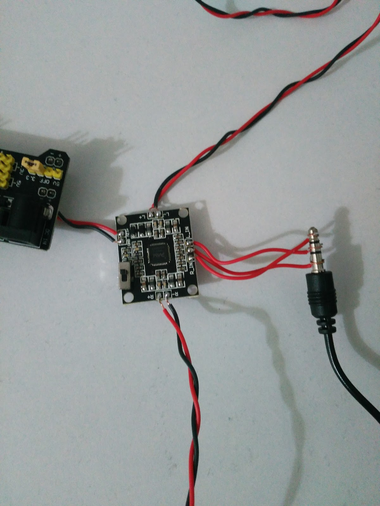
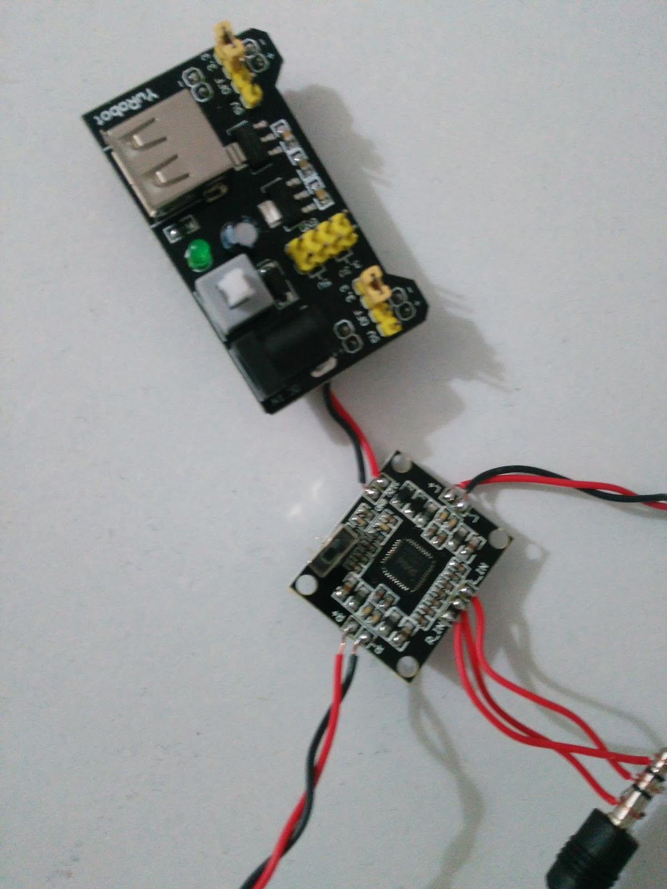
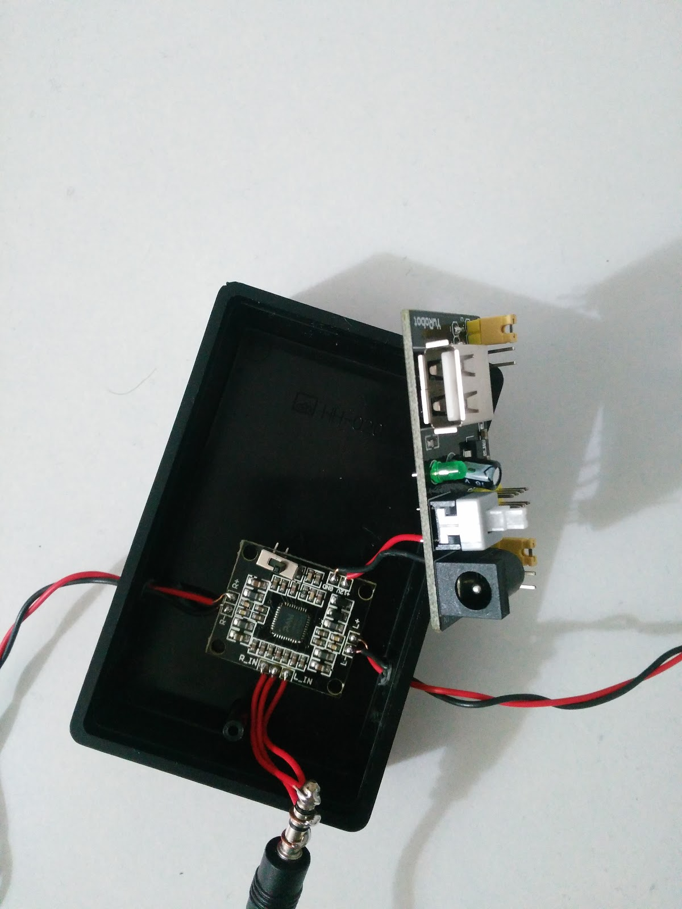
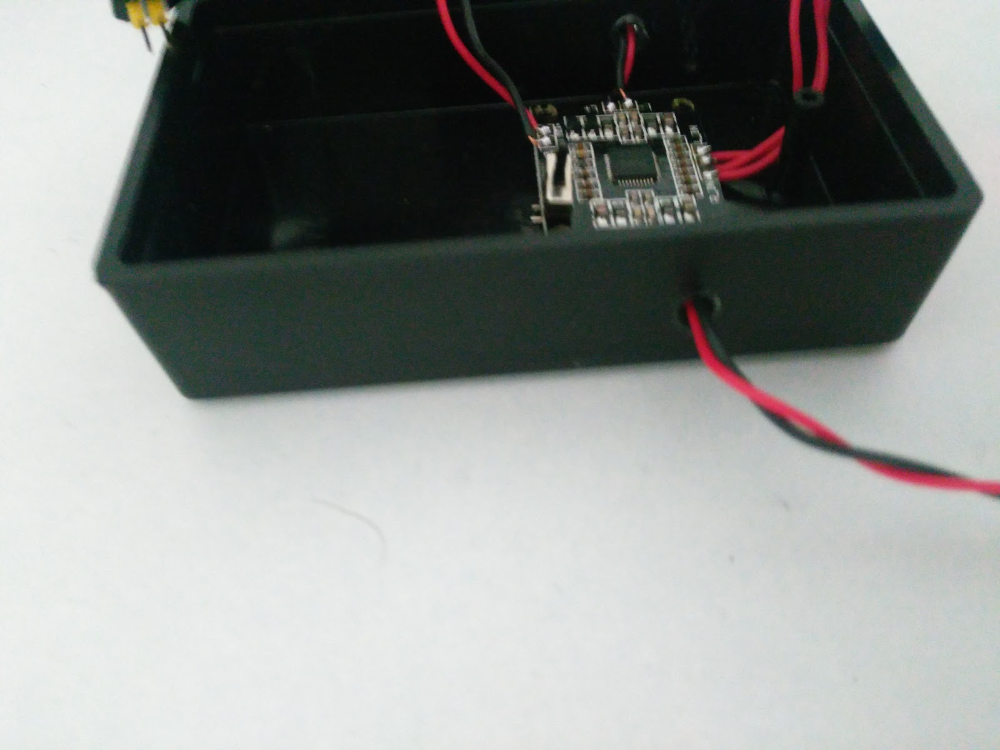
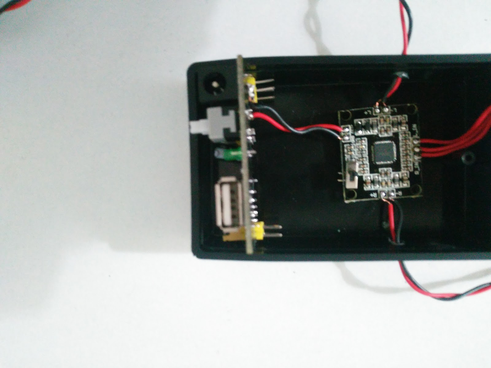
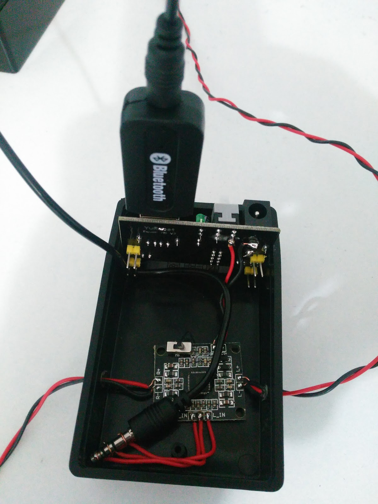
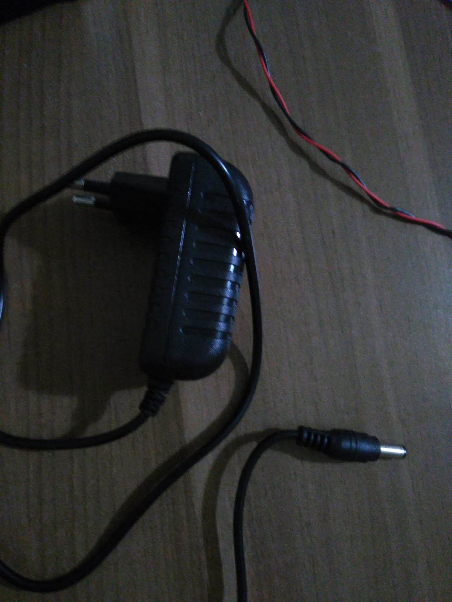
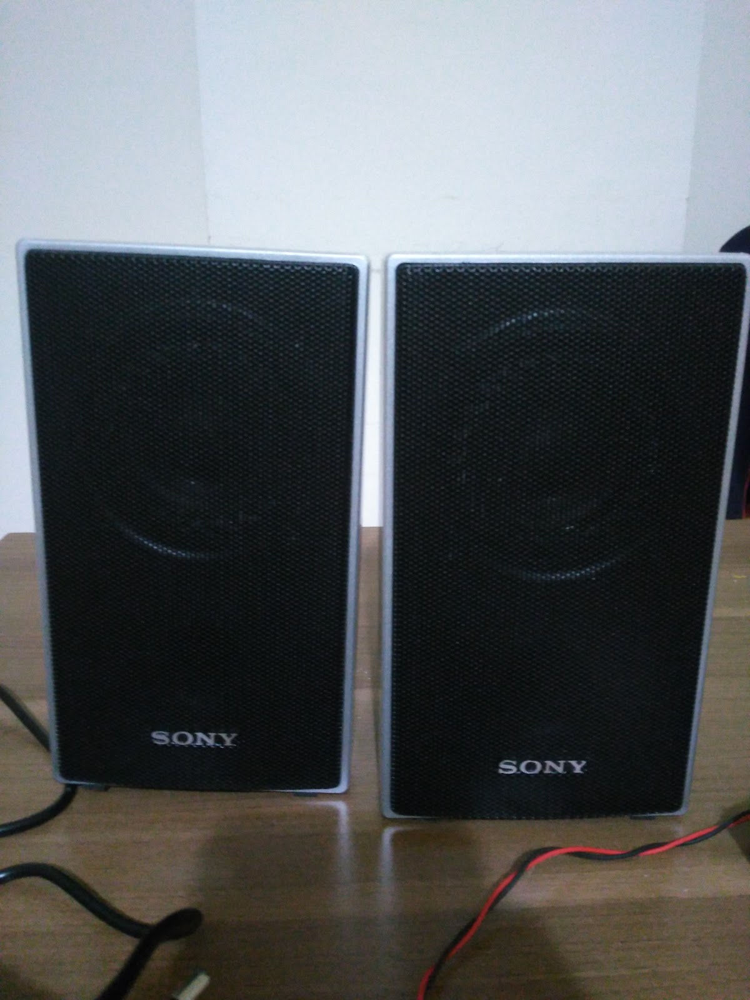
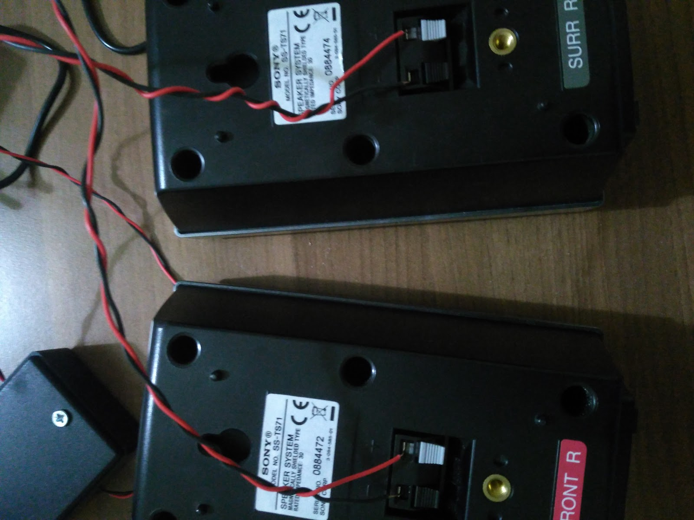
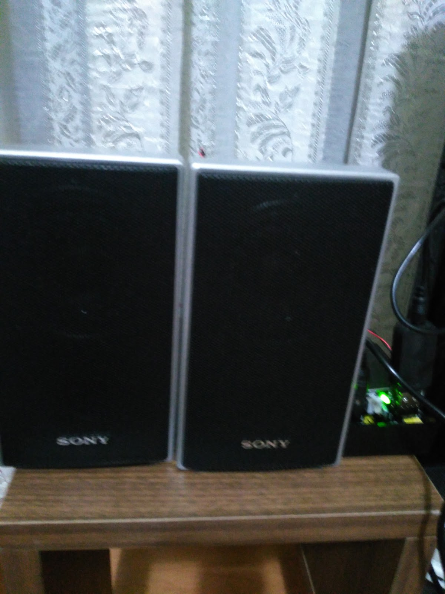

**Merhaba Arkadaşlar,**

Bu projemde nasıl elimizde kalan fazla hoparlörleri bluetooth speakera
dönüştürebileceğinizden bahsedeceğim. Geçen yaz bir arkadaşımın 5 +1 ses
sisteminin kuvvetlendirici kutusu yanmış böyle olunca da hoparlörler boşa çıkmış
ben de bir projede kullanırım diyerek kenara ayırdım. Aklıma sonradan bunları
bluetooth hoparlöre dönüştürmek geldi. Direk ses cihazı olarak görünen bluetooth
ses alıcılarını araştırmaya başladım. Bir kaç model bulsam da yaklaşık 10 W olan
bu hoparlörleri sürecek kadar güç çıkışı vermiyorlardı. Bu nedenle projeye bir
de kuvvetlendirici ekledim. Kuvvetlendirici  olarak PAM8610 seçtim. Kendisi bir
class D güç kuvvetlendiricisi yani en verimli olanlarından. Yüksek verini
sayesinde çok az enerji ısıya dönüşüyor ve soğutucu metal parçaya vb ihtiyaç
duymuyor. Yaptığım proje ile bu hoparlörleri, bluetooth üzerinden ya da doğrudan
kablo ile ses çıkışlarına bağlanabilecek duruma getirmiş oluyorum.

Toparlamak gerekirse proje için gerekli malzemeler:

- 1 veya 2 adet hoparlör
- Pam8610 ses kuvvetlendirici
- Bluetooth ses alıcı
- 3.5 mm ses kablosu
- Breadboard güç kartı olarak satılan DC 12 v girişi olan, usb, 5v ve 3.3v
  çıkışı olan kartlardan.
- Hepsini içine koyacağımız kutu

İlk olarak görüldüğü gibi PAM8610 üzerine bağlantıları yaptım. Direk ses jack'a
lehimlemek hiç uygun bir yöntem olmasa da elimde dişisinden olmadığı için başka
çarem yoktu. Projeyi yapmak isteyen arkadaşlara almalarını tavsiye ediyorum.
Hoparlörlere bağlantı kablosu olarak da düz kablo kullandım. Bu nedenle
elektriksel gürültüden etkilenebiliyor onları da en kısa zamanda değiştirmeyi
planlıyorum. Ama yakınlarında bir PC adaptörü gibi yüksek elektriksel gürültü
üreten şeyler olmadığı sürece ses kalitesi oldukça iyi.

PAM8610 12 volt ile çalışıyor bu yüzden güç dağıtım kartının güç soketine
doğrudan lehimledim. Yalnız bir ayrıntı var + terminali switchden sonraki yere
lehimledim böylece sadece düğme ile kapatabiliyorum.

Kutuyu kablolar için yanlarından deldim.

Güç konnektörünü yukarı bakacak şekilde kutuya sabitledim bu sayede bluetooth
ses alıcı direk olarak kutunun dışından usbye bağlayabileceğim.

Yukarıda bahsettiğim bağlantı şekli. Ses kablosu doğrudan bluetooth modulüne
gidiyor. Usb sadece güç vermek için kullanılıyor.

Beslemek için gerekli 12V adaptör. Uygun güç konnektörlü olanlarından seçtim.

Bahsettiğim hoparlörlerden 2 tanesi. Güçlendirici kartımız 15x2 W çıkış
verebiliyor. Stereo için uygun.

PAM8610 çıkışlarını 

Hoparlörleri evimde kullanmaya başladım bile... Yeni bir projede görüşmek
üzere...

