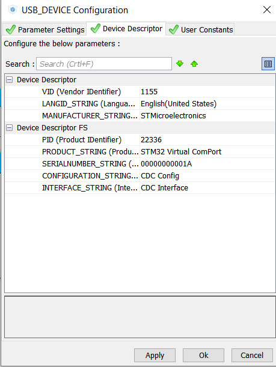

**Herkese Merhabalar,**\
Bu yazımda yeni bir alana hızlıca bir giriş yapıyorum. Zaman zaman
projelerimizde 8 bitlik atmel veya pic işlemcilerin beklentiyi karşılamadığı
oluyor. Böyle durumlar için ST Microelectronics firmasının STM32 isimli 32
bitlik işlemcilerini önerebilirim. 32 Bit işlemciler için en çok kaynak
bulanabilecek işlemci takip ettiğim kadarıyla. ST firması çoğu gelişitme aracını
da ücretsiz olarak sağlıyor. Bu yazıda tanıtacağım kartlar Arm Cortex M3
mimarisi tabanlı geliştirme kartlarıdır. Peki bu çekirdeği neden seçtim? Bir
cümleyle özetlemek gerekirse 8 bitlik islemcilere bariz üstünlük sağlayan ve
projelerin pek çoğu için yeterli özelliklere sahip olan en uygun fiyatlı
işlemci. Geliştirme kartı olmadan sadece işlemci 1 - 2 dolar gibi çok iyi bir
fiyata sahip. Özelliklerine aşağıdan ulaşabilirsiniz.

Evet özellikler güzel peki nereden nasıl başlarım diyorsanız size bir kaç önerim
var.\
Bu girişi yapmak için gerekli malzemeler:

- STM32F103C8T6 geliştirme kartı
- Stlink (Ya da FTDI üzerinden de kod yükleyebilirsiniz ama debug yapılmıyor)

Gerekli programlar:

- STM32CUBEMX
- SW4STM32

İlkönce malzemelerimizi inceleyelim:

32 bitlik arm işlemcilerin ortak özelliği genellikle çok pinli ve küçük
olmaları. Bu nedenle genellikle yüzey montaj teknolojisiyle lehimleniyor. Bu
yüzden eğer sabit bir tasarımınız yoksa geliştirme yapacaksanız pinlerin
denemeler icin dışarı çıkarıldığı geliştirme kartları kullanmak zorundasınız. Bu
kartlar sayesinde pinlere rahatça erişebilir, genellikle üzerinde bulunan
regülator, RTC, USB soketleri ve JTAG soketlerinin imkanlarından
yararlanabilirsiniz.\
Aşağıdaki linkten bendeki geliştirme kartının devre şemasına ulaşabilirsiniz.

STM32F103C8T6 Geliştirme Kartı\
[https://www.openimpulse.com/blog/wp-content/uploads/wpsc/downloadables/STM32F103C8T6-Schematic-Diagram.pdf](https://www.openimpulse.com/blog/wp-content/uploads/wpsc/downloadables/STM32F103C8T6-Schematic-Diagram.pdf)\
[https://www.openimpulse.com/blog/wp-content/uploads/wpsc/downloadables/STM32F103C8T6-ARM-Development-Board-Cortex-M3-Datasheet.pdf](https://www.openimpulse.com/blog/wp-content/uploads/wpsc/downloadables/STM32F103C8T6-ARM-Development-Board-Cortex-M3-Datasheet.pdf)\
[https://www.openimpulse.com/blog/wp-content/uploads/wpsc/downloadables/MINI-STM32-Schematic-Diagram.pdf](https://www.openimpulse.com/blog/wp-content/uploads/wpsc/downloadables/MINI-STM32-Schematic-Diagram.pdf)

Geliştirme kartının biraz anlatmam gerekirse: Ana işlemcisi STM32F103C8T6 modeli
Arm Cortex M3 tabanlı bir işlemcisi var. Neredeyse bütün pinleri kolayca
ulaşılabilmesi için geliştirme kartında dışarı çıkarılmış. Ayrıca bir tane 8
Mhz, bir tane de 32khz kristal bağlanmış. Usb pinleri de uygun koruma dirençleri
takılarak bir usb konnektörüne bağlanmış. Buradan hem usb üzerinden güç
verilebiliyor hem de uygun programla usb üzerinden bilgisayar ile
haberleşebiliriz. 3 adet jumper var bunları farklı yerlere takarak usb
bağlantısını kesebiliyoruz, boot0 ve boot1 pinlerini ayarlayabiliyoruz. Kolayca
reset atabilmek için bir adet butonumuz var ve güç olduğuni göstermek için bir
adet ledimiz var.

### 1. Adım : STM32CUBEMX Üzerinden Projenin Oluşturulması

STM32CUBEMX ST firması tarafından geliştirilen görsel ayarlama programıdır. Bu
program sayesinde işlemcimizi görsel olarak ayarlayabiliriz ve o ayarlara uygun
projeyi farklı IDE seçenekleri için oluşturabiliriz. Oluşturulan projede HAL
driver veya CMSIS kütüphanesi ayarlarıyla uğraşmamıza gerek kalmaz CubeMX
hepsini projeye ekler.

STM32F103C8T6 işlemcisi seçilir.\

Bizi karşalayan ekran böyle olacaktır. Buradan kullanmak istediğiniz "Çevresel
Birimleri" seçip ayarlarını yapabiliriz. Örneğin Uart birimini aktifleştirip
baud rate'ini 9600 olarak seçebiliriz. Hatta Uart RX için çalışan bir DMA
interrupt'ı oluşturabiliriz. Üstelik sadece bir kaç tık ile.

Geliştirme boardu datasheetinden alınan devre şeması. CubeMX ayarlarken burdan
yararlanılır.

Kristal bağlantıları uart ve usb bağlantıları aşağıdaki gibi ayarlanmıştır.

Örneğin usb ayarları aşağıdaki gibi yapılabilir.\
[https://www.st.com/content/st_com/en/products/development-tools/software-development-tools/stm32-software-development-tools/stm32-utilities/stsw-stm32102.html](https://www.st.com/content/st_com/en/products/development-tools/software-development-tools/stm32-software-development-tools/stm32-utilities/stsw-stm32102.html)

Usb kullanmak istediğimizde Clock sorunun olacağını CubeMX önceden tahmin ettiği
için uyarı veriyor.

Usbye göre clock ayarları aşağıdaki gibi yapılabilir.

Her şey tamamlandığına göre artık projemizi oluşturabiliriz. Bunu ise sadece
"Generate Project" buttonuna basarak ve devamında istediğimiz IDE seçerek
yapıyoruz. Kendisi işlemcimize uygun paketleri indirip kuruyor ve projeyi
oluşturuyor.

### 2. Adım : SW4STM32 IDE Üzerinden Programın Yazılması ve Karta Yüklenmesi

Sonraki adım olarak yazılım geliştirilmesi ve kodun derlenip karta yüklenmesi
veya debug edilmesi kalıyor. Ben bu aşamada SW4STM32 kullandım. Bunu kullanma
sebebim açıkcası öğrenmek istemem. Çünkü bu IDE açık kaynak kodlu Eclipse IDE
üzerine geliştirilmiş bir IDE ve CubeMX tarafından destekeleniyor. Alternafik
olarak KEIL veya TRUE STUDIO da kullanabilirsiniz.

IDE projenin import edilmesi de çok basit ayrıntılı olarak girmek istemiyorum
aşağıdaki linkleri takip ederek projeyi bu IDE'ye yükleyip yazılımınızı
geliştirmeye başlayabilirsiniz.

[https://www.openstm32.org/Importing+a+STCubeMX+generated+project](https://www.openstm32.org/Importing+a+STCubeMX+generated+project)\
[https://drive.google.com/file/d/0B5j__Lyt9ozbWVM2SWJxXzJ3NDA/view?usp=sharing](https://drive.google.com/file/d/0B5j__Lyt9ozbWVM2SWJxXzJ3NDA/view?usp=sharing)

Bugünlük yazım bu kadar, önerilerinizi veya sorunlarınızı paylaşabilirsiniz.
Tekrar görüşmek üzere...
