**Herkese Merhabalar,**\
Bugünkü yazımda web tabanlı programlardan bahsetmek istiyorum. Web
teknolojilerinin gelişmesiyle beraber browser tabanlı oldukça yararlı ve
kullanımı da bir o kadar kolay programlar ortaya çıkmaya başladı. Hatta bunun
bir üst aşaması olarak ChromeOS browser tabanlı bir işletim sistemi bile var.
Ayrıca bu tarz programların projelerine dosyalarına her bilgisayardan
ulaşabilmek, kurulum yapmadan bir çok şeyi halletme gibi avantajları da var.
Böyle olunca ben de bu şekilde çalışan yararlı programları bir yazı altında
toplamak istedim. Bilmediğim daha bir sürü program olduğuna eminim eğer bana
yollayabilirseniz onları da yazıya ekleyebilirim.

### Scheme It

[https://www.digikey.com/schemeit/](https://www.digikey.com/schemeit/)

Devre şeması çizilebilen pcb tasarlanabilen programdır. Digikey tarafından
geliştirilmektedir. Kayıt olmanıza bile gerek yok tıklayın ve devrenizi çizmeye
başlayın.

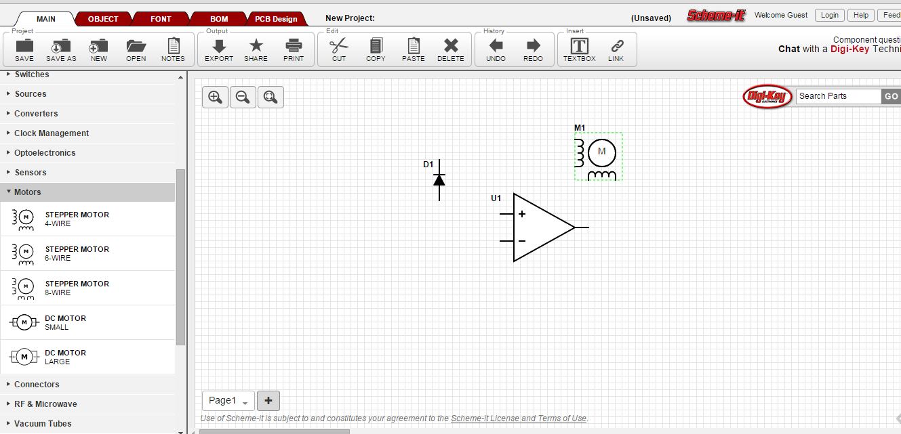

### Codenvy

[https://codenvy.com/](https://codenvy.com/)

Browser üzerinden kod yazıp yazdığınız kodları derleyebileceğiniz bulut tabanlı
ide. Desteklediği programramlama dili yelpazesi ise oldukça geniş.

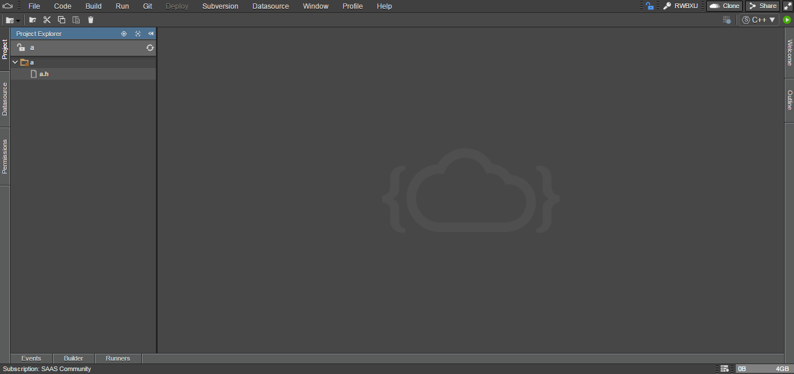

### 123D Circuits

[https://123d.circuits.io/](https://123d.circuits.io/)

Elektronik devreler tasarlayıp simüle edip devreleriniz için PCB
tasarlayabilirsiniz. Simülasyonlarınızda Arduino kullanabilirsiniz istediğiniz
kodları da yüklemeniz mümkün. Programın kullanımı oldukça basit ve ciddi işler
çıkarılabiliniyor. Autodesk firması tarafından geliştirilmekte olan bir program.

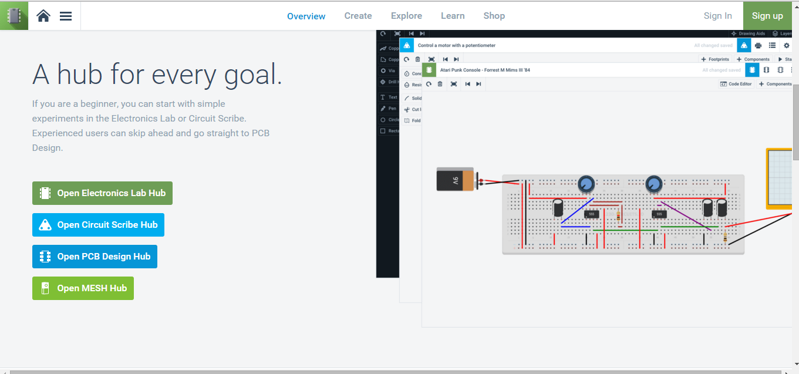

### Pixlr

[https://pixlr.com/editor/](https://pixlr.com/editor/)\
Browser üzerinden fotoğraf düzenleyebileceğiniz bir program. Kayıt bile olmadan
direk kullanmaya başlayabiliyorsunuz.

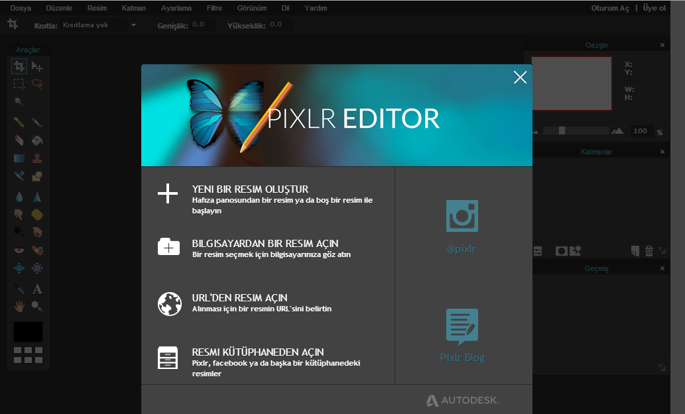

### Codebender

[https://codebender.cc/](https://codebender.cc/)

Tarayıcı tabanlı Arduino IDE'sı kütüphane desteği ve kod paylaşımı yönünden çok
iyi durumda. Kodunuzu yazıp kütüphanelerinizi online olarak ekleyip kodunuzu
derleyip Arduino'ya yükleyebiliyorsunuz.

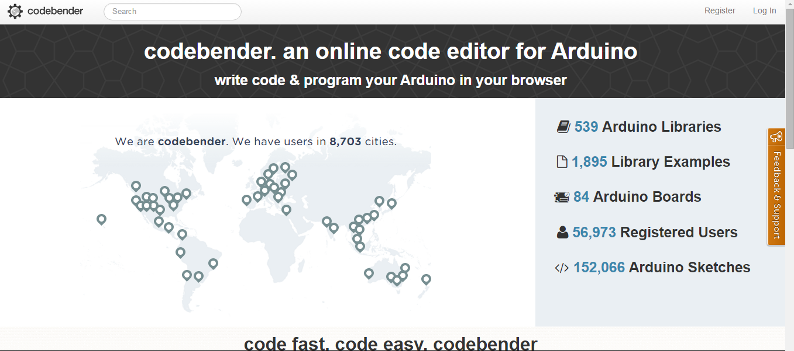

### C9

[https://c9.io/](https://c9.io/)

Codenvy gibi bu da browser tabanlı bir IDE. Bir sürü programlama dili seçeneği
mevcut.\
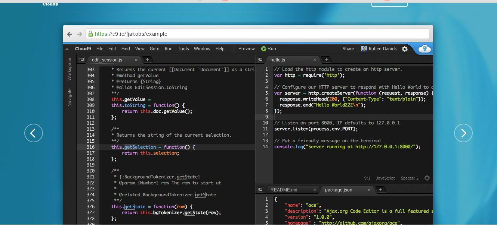

### Designmantic

[https://www.designmantic.com/](https://www.designmantic.com/)\
Logo dizayn programı, çok geniş bir ayar yelpazesi sunuyor ve kullanımı çok
basit. Afiş kartvizit dizaynı gibi seçenekleri var.

### Wolfram Alpha

[https://www.wolframalpha.com/examples/](https://www.wolframalpha.com/examples/)

Bu site hakkında sayfalarca yazı hazırlanabilir sanırım. En başta matematik
problemlerini çözmek için ortaya çıkmış site veri tabanını o kadar genişletti ki
çözüm sunduğu şeyler buraya sığdıramayacağım kadar uzun. Görüntü işleme ile
resimdeki nesnelerin tahmin edilmesinden, müzikten, alışverişten, yiyecek
içeceğe varıncaya kadar geniş bir konuya yayılmış durumda. Bir çok bilimsel
hesaplamayı kolayca yapabilir üstüne nasıl yapılacağını da buradan
öğrenebilirsiniz. Üniversiteleri araştırıp eğitim kariyerinizi
planlayabilirsiniz. Günlere göre döviz kurları verilerini erişip onları
istediğiniz gibi işleyebilirsiniz. Şu anki favori sitelerimden biri.

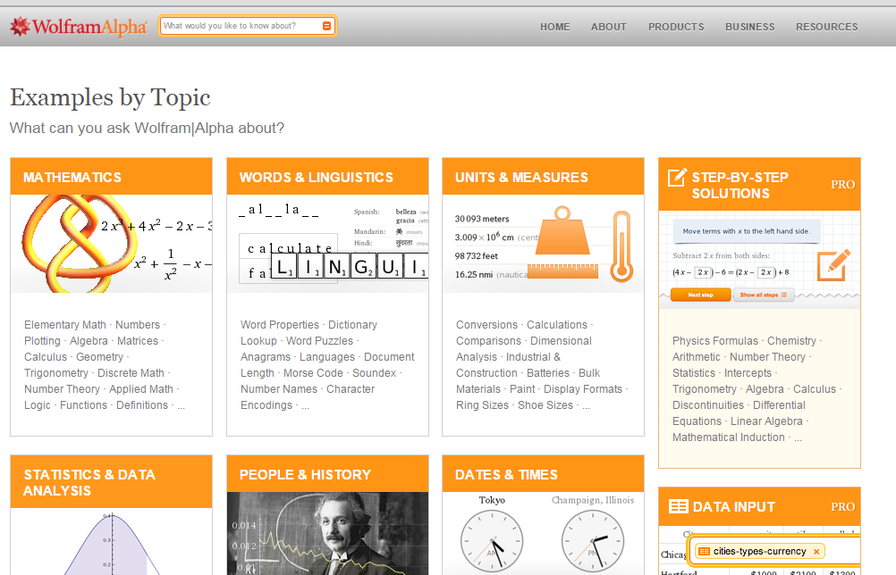

### Biodigital Human 3D

[https://human.biodigital.com/index.html](https://human.biodigital.com/index.html)

Bu da oldukça etkileyici bir çalışma. Human 3D programı kapsamında insan vücudu
en küçük kılcallarına kadar modellenmiş. İstediklerinizi seçip istediklerinizi
kaldırıp katman katman inceleyebilmeniz mümkün. Bir sürü hastalık için de
yazılar ve vücuttaki hangi bölgeleri etkilediğini gösteren animasyonlar
oluşturulmuş. Ayrıca bir kaç tık ile örneğin kolun anatomisine ulaşıp her hangi
bir kasın üzerine tıklayıp işlevine ulaşabilirsiniz.

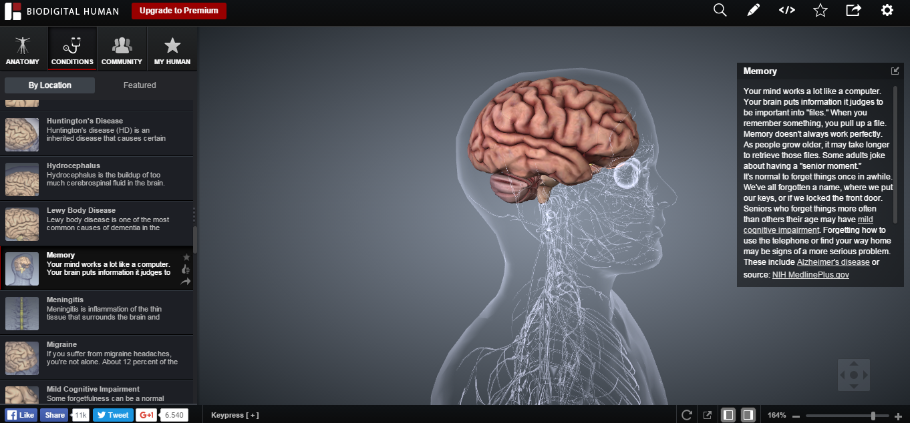

### MIT App Invertor

[https://appinventor.mit.edu/explore/](https://appinventor.mit.edu/explore/)\
MIT App Inventor görsel programlama kullanarak Android programları yapmanıza
yarayan bir sitedir. 5 dakika içerisinde android programınızı yapıp telefonunuza
yükleyebilirsiniz. Arayüzü ve arkasındaki tüm kodu sürükle bırak ile
tasarlıyorsunuz ama bu basitliği yapabileceklerinizi neredeyse hiç sınırlamıyor.
Bir çok sorunuzu çözecek uygulamaları kolayca yapmanız mümkün.

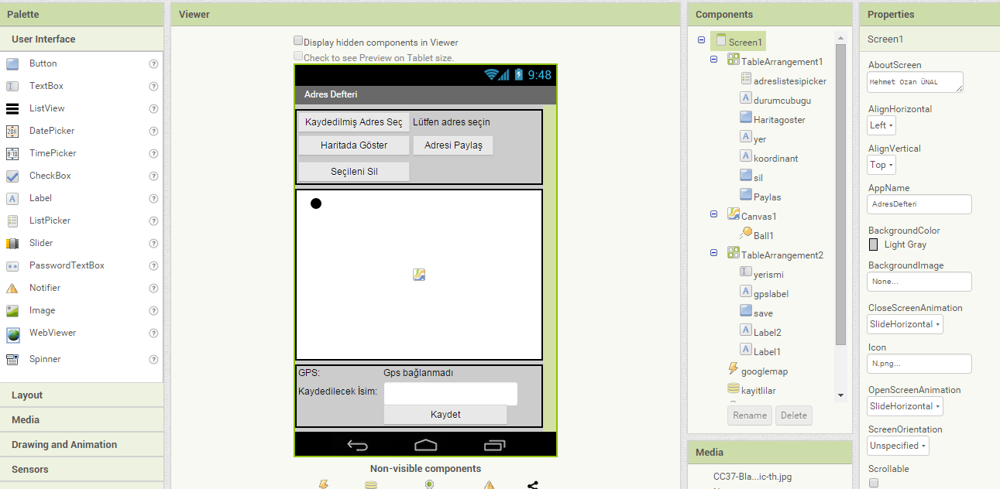

### Talky

[https://talky.io/](https://talky.io/)

Basit video chart programı. Sadece bir kaç link paylaşarak kolayca beraber
konuşmak mümkün.

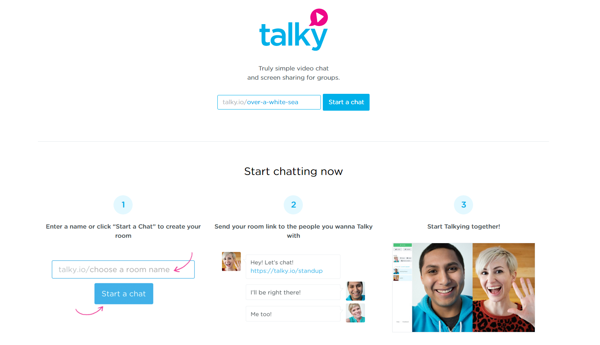

### Draw.io

https://www.draw.io/

Basit bir şema, flowchart, tablo çizme programı. Direk google drive veya dropbox
üzerinden çalışılabiliyor. Kullanımı kolay aynı zamanda başarılı ve çok fazla
çeşit çizimler yaratabileceğiniz bir program.

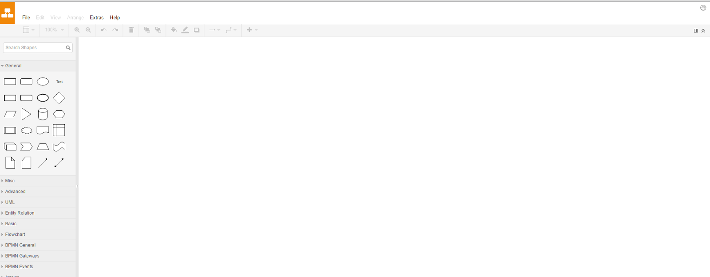
