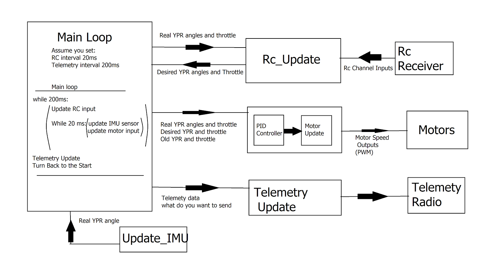
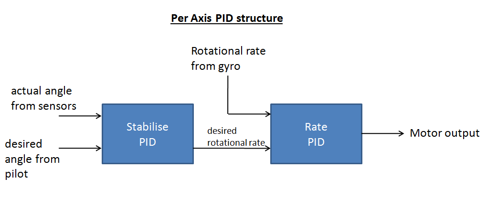
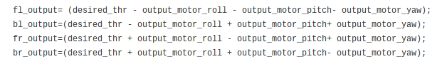
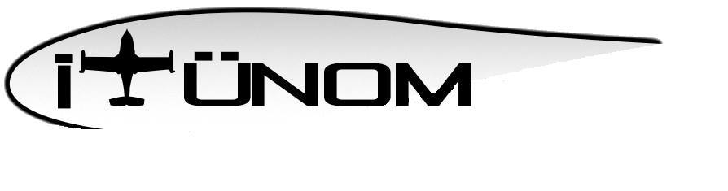

**Merhaba arkadaşlar,**\
      Bugünkü yazımda geçen senelerde üzerinde uzun zaman harcadığım fakat
tamamlayamadığım bir konu olan otopilot yapmak üzerine edindiğim tecrübeleri
anlatmak istiyorum. Yazıya başlamadan önce bu çalışmaların tamamını beraber
yaptığım **Bahadır Gökçeaslan** teşekkür etmeyi bir borç bilirim.

Evet otopilot aslında benim anlatacağım bölüme kıyasla biraz fazla geniş bir
kavram oldu. Zira malesef proje uçuş kontrolcüsü aşamalarında kaldı. Bir soru
ile başlayalım. Bir uçuş kontrolcüsü nedir? Bir uçuş kontrolcüsü temel olarak
havada uçan bir aracın yere göre açılarının istenilen şekilde olmasını sağlayan
sensör ve hareketli mekanizmalar bütünüdür. Aslında yere göre açılarla
sınırlamak çok mantıklı değil. Bir hava aracının yükseliğinin sabit olması veya
istenilen hızda istenilen konumda kalmasını sağlamak da bunun işidir. Fakat bu
projede, bir Quadcopter uçuş kontrolcüsü olarak tasarlanmış olan bu yapıda amaç
quadcopterin yere göre açılarını kumandadan gelen girdilere göre kontrol
etmekti.

Peki bu IMU açılar nasıl kontrol edilir? Hepinizin bildiği gibi bi quadcopter
yere itki veren 4 adet motordan oluşan bir mekanizma. Ama bir quadcopteri havada
tutmak göründüğü kadar kolay değildir. Basit olarak yapılan işlem quadcopter
motorlanının hızını istenilen açıda kalacak şekilde kontrol etmektir. Bunun için
de 2 temel yapı kullanılır. **IMU** denen bu açıları ölçen sensörler ve **PID**
denilen kontrol algoritması. Bu noktada eğer bu kavramlar tanıdık gelmediyse
[imu hakkındakı şu yazımı](https://mozanunal.com/2014/11/imu-aclarnn-3-boyutlu-olarak/)
ve
[pid hakkındaki bu yazımı okumanızı tavsiye ederim](https://mozanunal.com/2015/07/multikopterler-icin-pid-kontrol/).
Kodu inceleyecek olursanız projemizi belli parçalara ayırmış durumdayız. Bu
parçalar şunlardır:

- Kumandadan girdilerin alınması
- IMU açılarının güncellenmesi
- Girdi değerlerine ulaşmak için gerekli motor hızlarının pid algotirmasıyla
  hesaplanması
- Telemetri datasının yollanması 

Ben bu yazıda daha çok 3\. madde üzerinde duracağım. Öncellikle bir eksende
kontrolü ele alalım. Bir eksende kontrol için yapılması gereken işlem şöyledir:

- Imu üzerinden şuanki açı ve ve kumandadan o eksen için istenen açı alınır. (
  Otopilotlu bir yapıda istenen açıyı, verilen koordinata gitmek için kendisi
  hesaplar. ) 
- Şu anki açı hatası
- Geçmişteki açı hatası toplamı
- Gelecekte oluşabilecek açı hatası tahmini
- Üsteki 3'ü kullanılarak **hedef açı için gerekli açısal hız** bulunur.
- Şuanki açısal hız hatası
- Geçmişsteki açısal hız hatası toplamı
- Gelecekte oluşabilecek açısal hata
- Üsteki 3'ü kullanılarak o eksen için **pıd çıktıs**ı hesaplanmış olur.

Bu şekilde bir eksenin kontrolü için 2 katlı pid işlemi uygulamak gereklidir.
Peki 3 eksenin için nasıl bir çözüm kullanmak gerekir. Bunu anlatmak yerine şu 4
satır kodu buraya eklemek istiyorum. (output_ ile başlayanların ilgili eksen ile
alakalı pıd çıkışı olduğunu varsayın. )

Bu iki satır sayesinde toplam 6 pid kontrolcüsünden oluşturulan hesaplamalar
birleştirilir. Birleştirme esnasındaki işaretlerin mantığını siz de
farketmişsinizdir. O eksen için pid etkisi negatif mi pozitif mi? Yani o motorun
hızının artması o eksende ne yönde bir hareket sağlar.

Evet son olarak bizim projemizden bahsedeyim. Ortalıkta uzun yıllardır açık
kaynaklı otopilotlar var biz de bunun farkında olmamıza rağmen kendimizi
geliştirmek amacıyla bu projeye başladık. Malesef test düzeneklerine ve projenin
geliştirilmesine daha sonrasında zaman ayıramadık. Ama dediğim gibi bu konuyla
alakalı değerli tecrübelere edindiğimizi düşünüyorum. Belki günün birinde
tamamlarız.\
Yaptığımız çalışmaların tamamının
linki: [github.com/mozanunal/SimplePilot](https://github.com/mozanunal/SimplePilot)

Genellikle arduino kütüphanelerini kullandığımız için bizim kodumuz performans
açısından pek uygun olmadığını düşünüyorum. Ama
[şuradaki yazıda](https://blog.owenson.me/build-your-own-quadcopter-flight-controller/)
ardupilot kütüphanelerini kullanarak olayın temelini de anlatarak güzel bir yazı
ortaya koymuş bir arkadaşımız var. Benzer şeyler yapmak isterseniz onu kod
olarak da referans alabileceğinizi düşünüyorum. İncelemenizi tavsiye ederim.
Tekrar görüşmek üzere...

[www.facebook.com/itunom](https://www.facebook.com/itunom/)\
[www.itunom.com](https://www.itunom.com/)
