**Herkese Merhabalar,** Son yıllarda hobi elektroniği inanılmaz bir hızla
gelişti. Şüphesiz bu hızlı gelişmenin mimarı Arduino. Atmelin 8 bitlik
işlemcilerini temel alarak tasarlanan bu kart ve programala dili sayesinde
insanlar kolayca projeler geliştirmeye ve hobi uygulamaları yapmaya başladılar.
Ama Arduinonun ve hatta daha iyi bir mikroişlemcinin de yeterli olmadığı
projeler var. Böyle bir ihtiyaç doğduğunda seçenekler kendini geliştirmek
isteyenler için çok sıkıntılı hale geliyor. Önceki yazılarımdan birinde STM32
öğrenmeye nasıl başlanır ve proje nasıl oluşturulur onu anlatmıştım. Bu sefer
mikroişlemcinin yanı sıra bir fpga üzerine gitmek istiyorum. Mesela yüksek
hesaplama gücü ve paralel işlem gerektiren proje yapmak istiyorsunuz ve fgpa
öğrenmek istiyorsunuz. Nasıl başlayabilirsiniz onu anlatmak istiyorum.

### Geliştirme Kartı Seçimi

İlkönce geliştirme kartımızdan bahsedeyim. Ben üzerinde Cyclone IV bulunan
Altera(Artık Intel oldu) marka bir kart seçtim. İlk nedenim **maliyet**. Usb
blasterıyla birlikte oldukça uygun fiyatlara( **22$**) alabiliyorsunuz. Fpgaler
mikroişlemciler göre oldukça pahalı malzemeler o yüzden böyle bir başlangıç
yapmak istedim. Diğer bir avantajı da bence geliştirme ortamının(Quartus) **daha
hafif** olması ve lite sürümünde **lisans prolemi** yaşamadan
kullanabilinmesidır. Xillinx fpgaleri hem ISEde hem VIVADOda kullandım.
Geliştirme ortamları oldukça ağır ve ayarlama süreçleri daha sancılı geldi bana.
Tabi bu konu malesef çok tecrübeli olduğum bir konu değil. Mesela büyük ve
karmaşık projelerde daha büyük kolaylıklar sağlıyor olabilir. Bir diğer
dezavantaj da geliştirme kartının üzerinde 2 buton ve 1 ledden başka direk
kullanabileceğimiz ekipmanlar yok. Fakat elimizde bir sürü gpio var, her türlü
sensörü biraz uğraşarak bağlamamız mümkün o yüzden bu durumu büyük bir problem
olarak görmüyorum.

- [Fpga Kartı](https://www.aliexpress.com/item/Free-shipping-EP4CE6-altera-fpga-board-fpga-development-board-fpga-altera-board-fpga-development-board-cyclone/32709028421.html?spm=a2g0s.9042311.0.0.VBIflb)
- [Usb Blaster](https://www.aliexpress.com/item/altera-Mini-Usb-Blaster-Cable-For-CPLD-FPGA-NIOS-JTAG-Altera-Programmer/2038559613.html?spm=a2g0s.9042311.0.0.NiCA6G)

### Bağlantılar

Fpga kartını aşağıdaki gibi bağlamalıyız. Bunun için bilgisayarımızda 2 adet usb
portu olması gerekir. İlk port güç için kullanılıyor. İkinci port da jtag olarak
kullanılıyor; buradan kod yükleme, debug gibi operasyonları
gerçekleştirebiliriz.

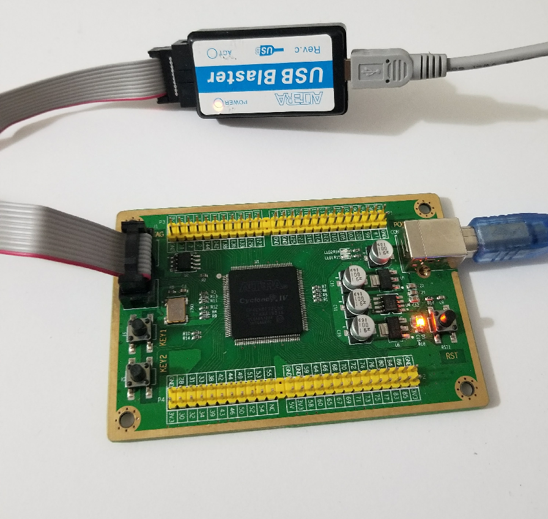

Aşağıda ise geliştirme kartının pin bağlantılarını bulabilirsiniz. Bunu
aliexpressden kopyaladım. Çok güvenilir bi kaynak değil ama pinleri kontrol
ettim problem yok.

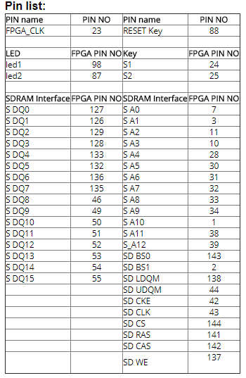

### Proje oluşturma

Bu bölümde Quartus Prime kullanarak nasıl proje oluşturacağımızı anlatacağım.
Aşağıdaki ekran açılış ekranı. Burdan yeni proje oluşturmayı seçiyoruz.

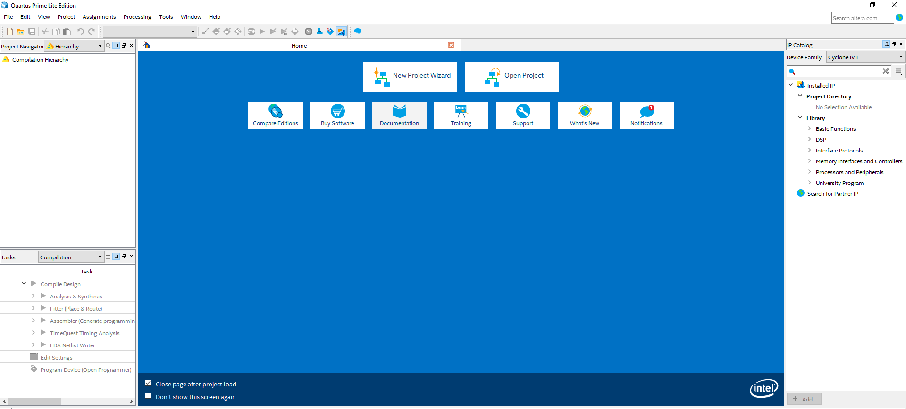

Projemizi oluşrutulacağı dosya dizini ve ismini seçiyoruz.

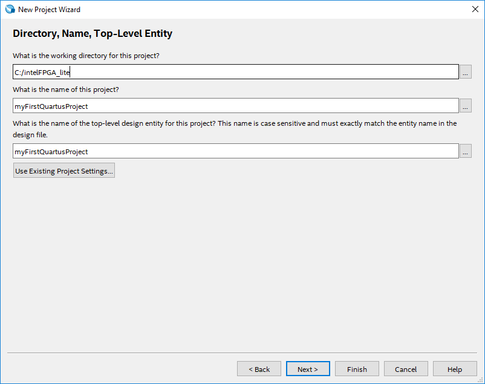

Proje tipi olarak boş proje seçiyoruz.

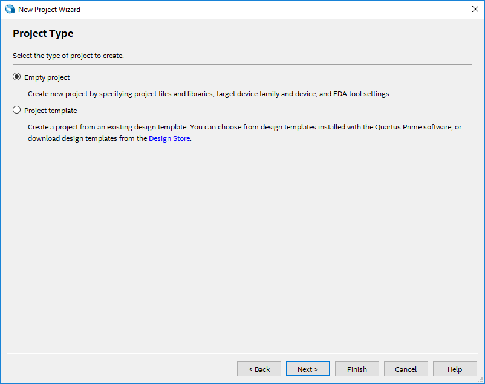

Burada Fpga kartımızın üzerindeki chipseti seçmemiz gerekir. Bu karttaki
çipsetin tam ismi Cyclone IV EPCE6E22C8. Çipin üzerinden direk okuyabilirsiniz.

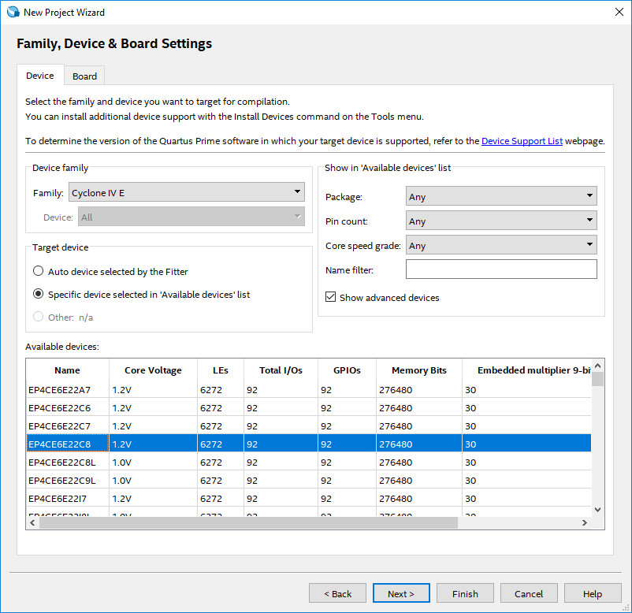

Malesef Eda toolarıyla veya simülasyonla alakalı bir tecrübem olmadı henüz o
yüzden boş bıraktım buraları.\
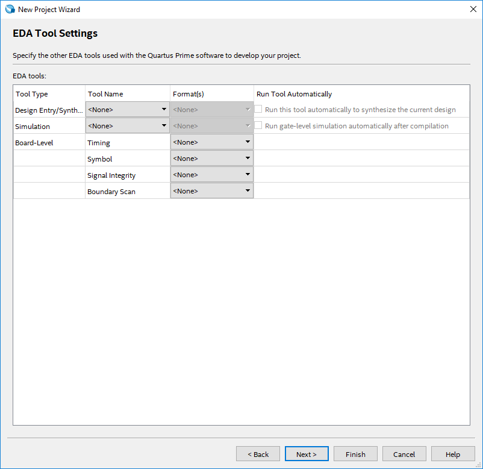

Bu proje oluşturma için son adımdı. Seçimlerimizle alakalı bir özet sayfası.

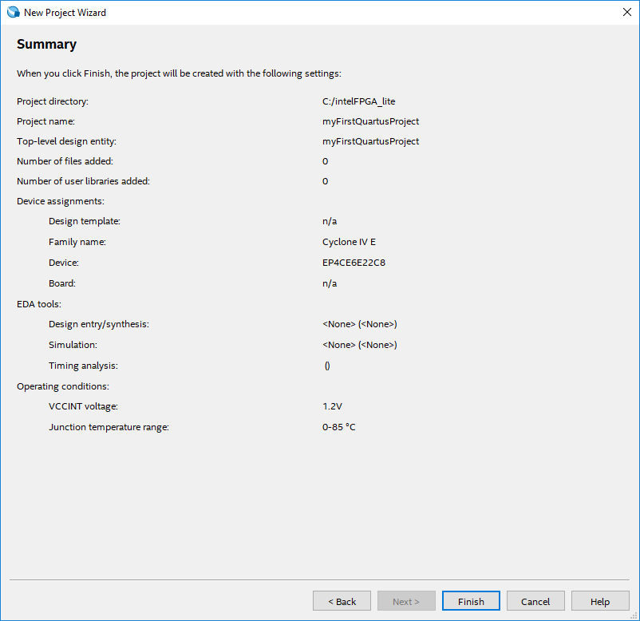

### Hello World

Bildiğiniz gibi programlama dillerinde veya elektronik kartlarda ilk
çalıştırılan koda-uygulamaya "Hello World" uygulaması denir. Biz de hello world
uygulaması olarak and gate yapacağız.

Sol tarafta projedeki dosyaların ve modullerin hiyararşik dizilimini
inceleyebilirsiniz. Proje geliştirme esnasında burası ile çok fazla haşır neşir
olacaksınız.

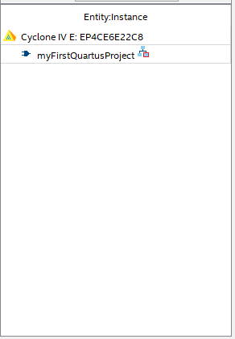

Devamında projeye bir verilog dosyası ekleyebiliriz.

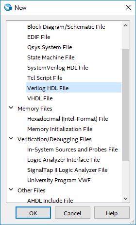

Oluşturulan dosya "top module" olarak seçilmelidir. Aşağıdaki verilog kodları
yazıldıktan sonra üçgen mavi ok ile proje compile edilir. Peki compile aşamaları
nelerdir derseniz:

- İlkönce tariflediğimiz hardware'ın şeması oluşturulur.
- O şema lutlar ile ve fpga üzerine uygulanabilecek hale getirilir.
- Oluşturulan yeni şema fpga üzerinde bi yerlere oturtulur. Bu işleme routing
  denir.
- Son olarak binary dosya oluşturulur. Sol alt kısımda görüldüğü gibi bütün
  işlemler yeşil olmalıdır. Yoksa kodunuzda bir problem var demektir.

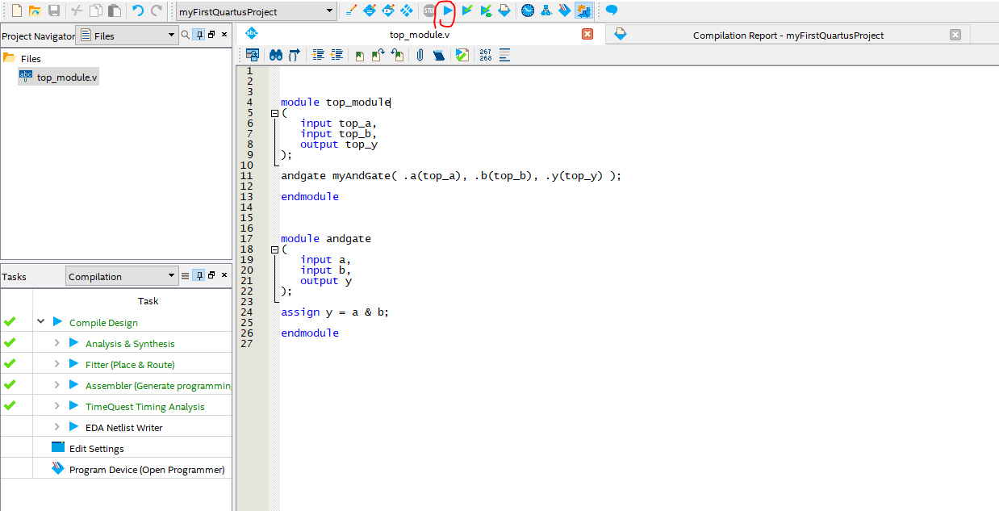

- Bu arada kodu derlemen önce "Pin Planner" aracı kullanarak "top_module"deki giriş çıkışları gerçek pinlere
  bağlamak gerekir. Ben burada 2 butonu and kapısının girişlerine, ledi ise and
  kapısının çıkışına bağladım.

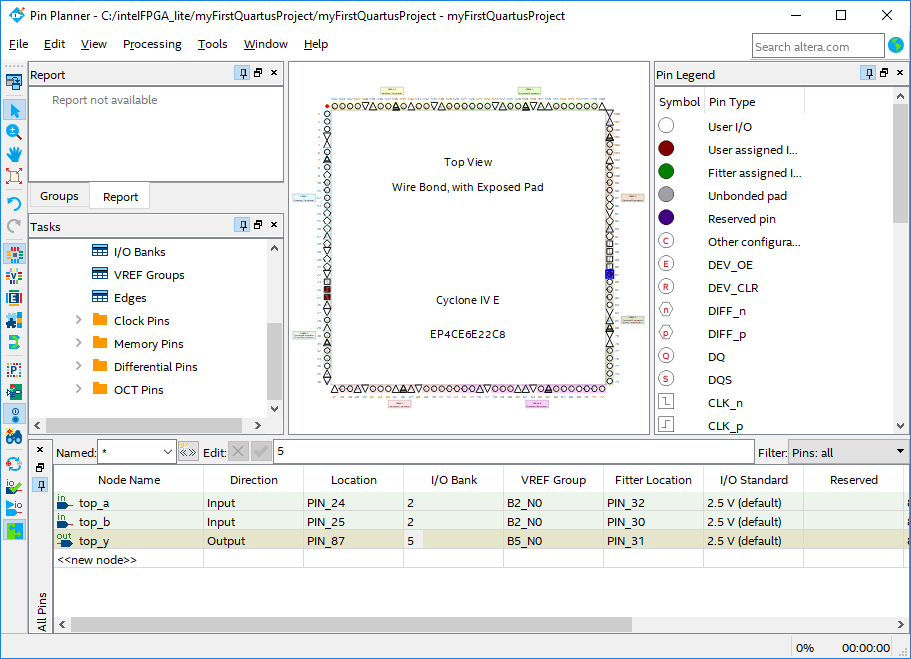

- Projenin derleme raporunun bir kısmı aşağıdaki gibidir.

- Sonra "programmer" açılır. Usb blaster göremezse sürücülerinin güncellemesi gerekir. Eğer sürücü problemi yoksa Usb Blasterı otomatik gözükecektir.

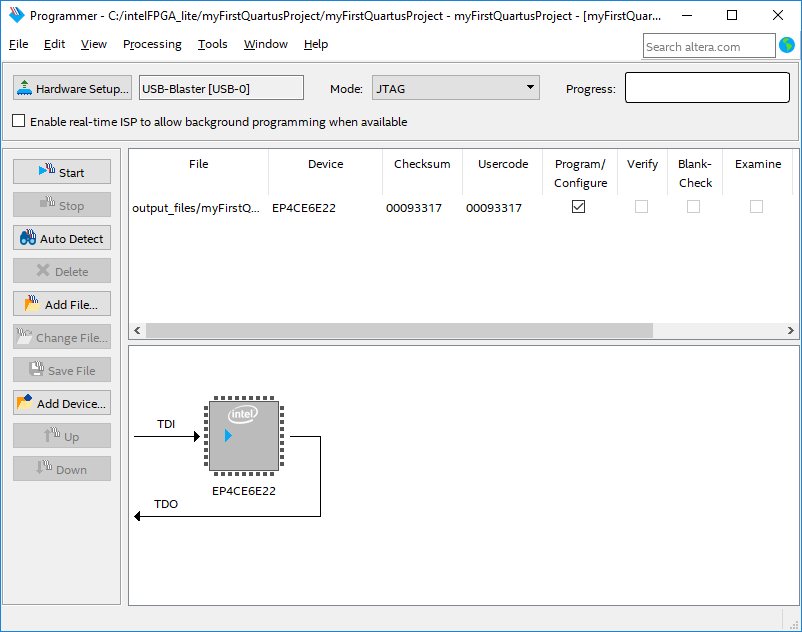

- Son olarak start tuşuna
  bastığımızda kodu fpgaye yükleyecektir. Daha sonrasınd "key1" ve "key2"
  butonlarını kullanarak kodu test edebilirsiniz. Bu yazı için anlatacaklarım bu
  kadar. Projemizle fpga dünyasına hızlı bir giriş yapmış olduk. Hem de oldukça
  uygun fiyatlı bir paket ile. Umarım bu tarz cihazların kullanımı hobi
  elektroniğinde ve elektronik eğitiminde hızla artar. Tekrar görüşmek üzere...

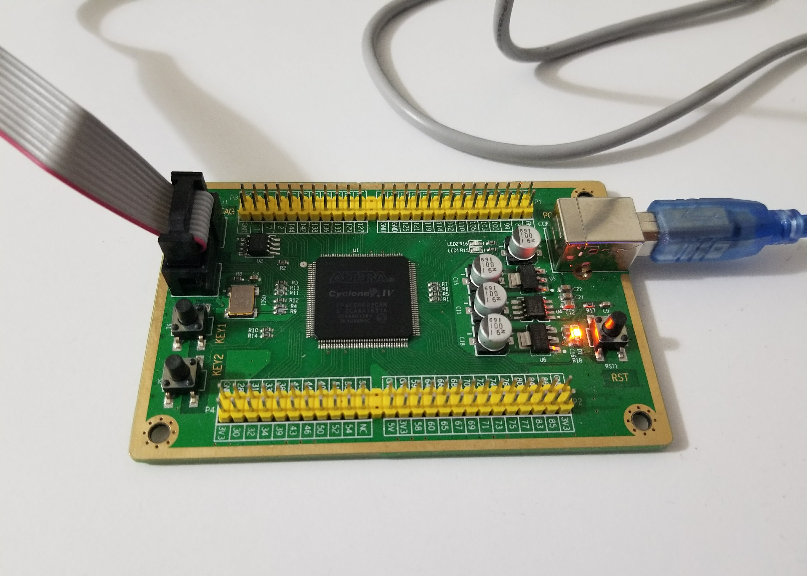

https://www.altera.com/en_US/pdfs/literature/ug/ug_civgx_fpga_dev_kit.pdf
