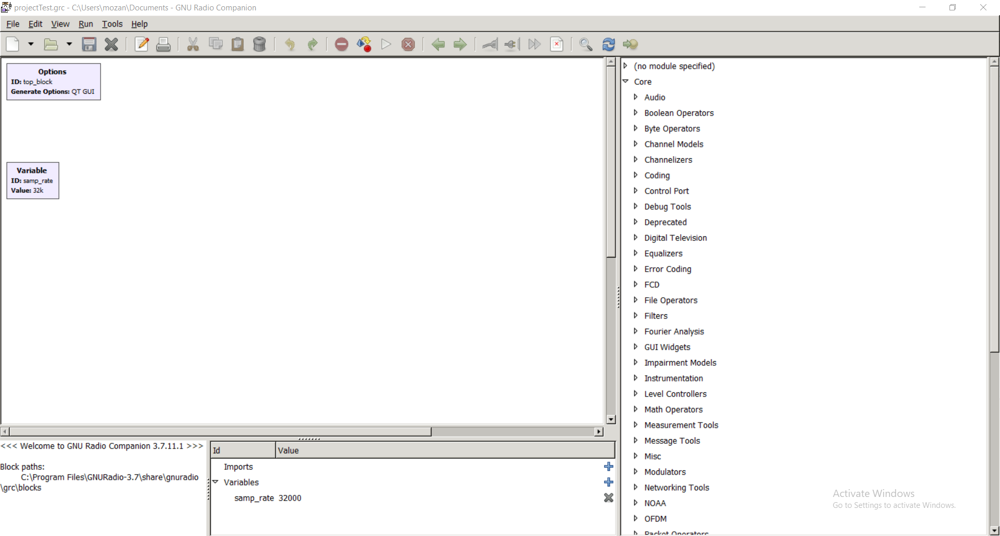
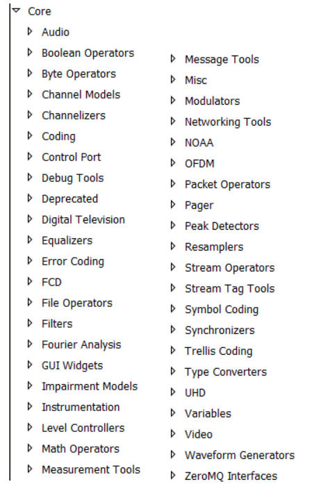
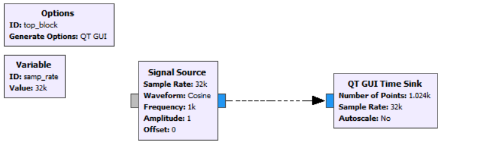
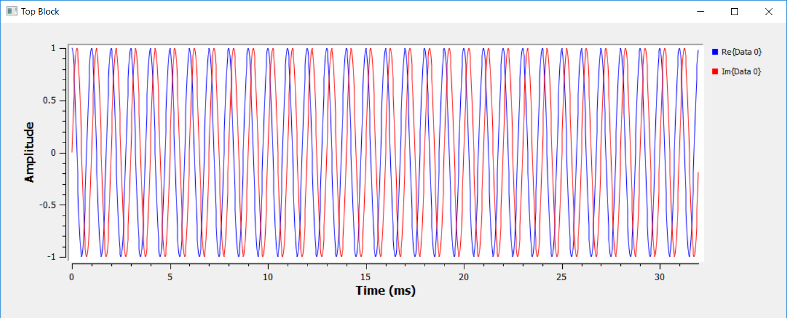
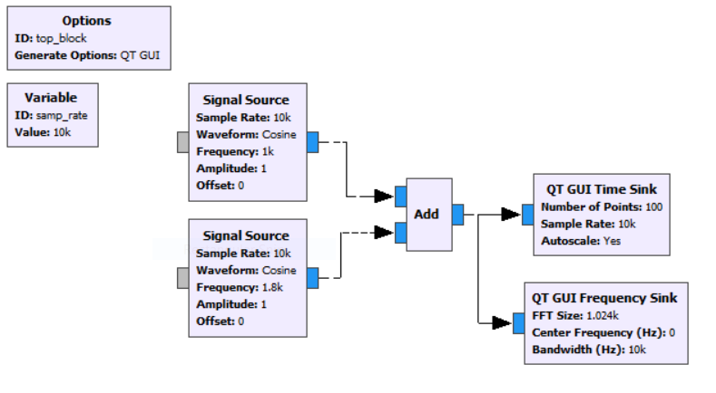
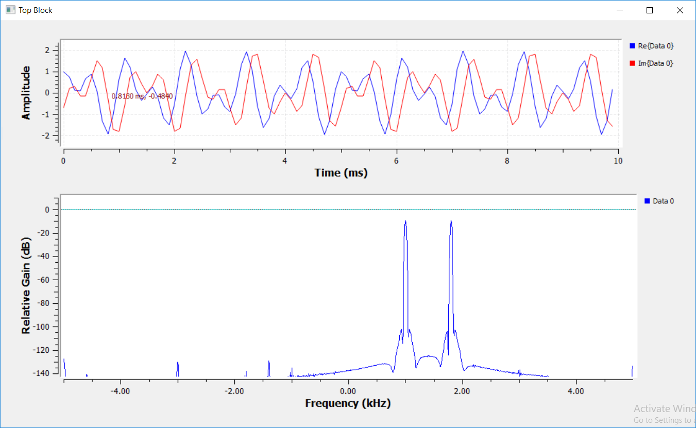
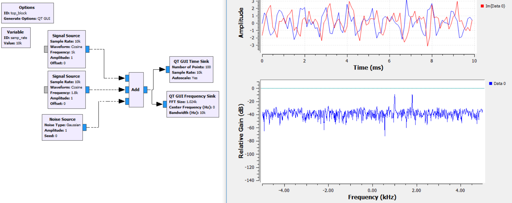

**Herkese Merhabalar,** Gnu Radio son zamanlarda keşfetmekten en çok keyif
aldığım program olabilir. İlk defa duyanlar için özetlemem gerekirse içerisinde
sinyal işleme ve sayısal haberleşme araçları toplanmış görsel programlama
editörü. Sinyal dosyadan veya daha önce bahsettiğim SDR isimli cihazlardan
alınabiliyor. Alınan sinyaller sayısız çeşitlilikte araçlar ile işlenebiliyor.
Coding, modulasyon, demodulasyon gibi haberleşme işlemlerini sürükle bıraklarla
kolayca uygulamak mümkün.

Programı kurduktan sonra bizi ilk olarak aşağıdaki gibi bir ekran karşılıyor.
Sağ tarafta program içerisindeki araçları görebilirsiniz. Hepsi aslında belli
işlevi olan bir kutu. Sürükleyerek yapmak istediğimiz operasyonu gerçekliyoruz.

Paketlere bir göz atmak isterseniz; üst başlıkları aşağıdaki resimdeki gibi
sıralanmış. Gördüğünüz gibi çeşitlilik inanılmaz geniş. Qt veya wx ile
görselleme pencereleri de tasarlamak mümkün. Filter dizayn araçlarını da program
içinde bulunduruyor. Yazının devamında çok basit bir şeyler yaparak nasıl
çalıştığını göstermek istiyorum.

### Basit Sinyal İnceleme

Aşağıdaki örnekte sinyal kaynağından 1 khz cosünüs dalga ürettim çıkışını da
direk olarak zaman domaini analiz için kullanılan qt görselleştirme aracına
bağladım.

Bu programı çalıştırdığımızda aşağıdaki gibi bir çıktı alıyoruz.

### İki Sinyali Toplama

Bu sefer çok basit olarak 2 farklı sinyal toplandı ve çıkış çoklanarak zaman ve
frekans domaininde analiz edildi. Örnekleme frekansını değiştirdiğim için
sinyaldeki kırılmaları zaman domaini grafiğinde görebilirsiniz.

Beklediğimiz üzere 1khz ve 1.8 khz frekanslarında tepeleri görebilirsiniz.
Elimizdeki sinyali kolayca inceleyebiliyoruz.

### Gürültü ekleme

Son olarak sinyalimize biraz da gürültü ekledim. Giriş frekanslarımızdaki
tepeler biraz daha gürüştünün içinde kayboldu ama yine de filtrelenebilecek
durumda. Filtreleri de bu yazıda anlatmak isterdim ama onlara da girersem GNU
Radio giriş yazısı biraz konu dışına çıkmış olacağımı düşünüyorum. Bu program
üzerinde bir şeyler geliştirip bu yazı serisini devam ettirmek istiyorum.
Görüşmek üzere...

