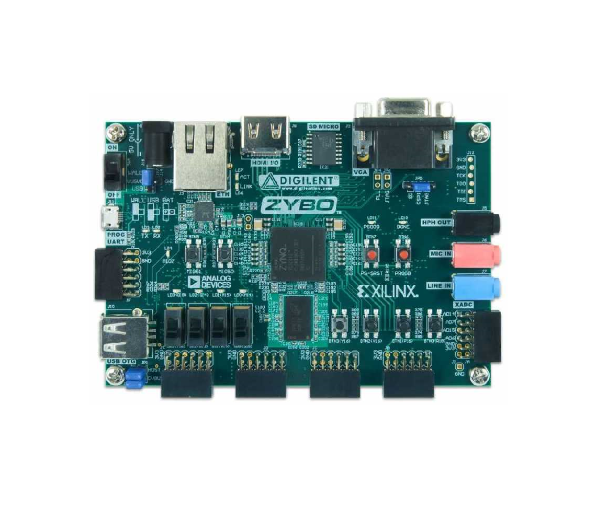

**Herkes Merhabalar,** Bugün bir "hardware description language" olan verilog
diline giriş yapmak istiyorum. Verilog sayısal dizaynda( ASIC ve FPGA )
kullanılan bir tanımlama dilidir. Verilog dilini Fpga programlamak için bir çok
projede kullandım fakat ASIC dizayn konusunda bir tecrübem yok. Fpga
programlarken öğrendiğim şeyleri farklı yazılarda paylaşmıştım. Bu yazı da o
yazılardan biri diyebiliriz. Verilog ile alakalı daha ileri düzey şeylerden
bahsedeceğim yazılar da gelecektir diye düşünüyorum.



### Temel Kullanımlar

İlk olarak basit mantık fonksiyonlarının verilog modüllerinin oluşturulmasıyla
başlamak istiyorum. Bu fonksiyonları oluşturmak için bir kaç farklı seçeneğimiz
var. Ben kısaca hepsinin üzerinden geçmek istiyorum. Bu yöntemlerin hepsine
aşina olmak şu açıdan önemlidir: Her projede farklı zorluklar karşımıza
çıkabilir. Bu zorluklardan en çok ortaya çıkanlardan biri kaynak
yetersizliğidir. Kaynak yetersizliği farklı açılardan ortaya çıkabilir.

- Zamanlamanın yetersiz olması
- Fpgadeki mantık kapılarının yeterli olmaması
- Performansın yeterli olmaması Bu 3 farklı dar boğaza göre farklı imlemantasyon
  yöntemini tercih etmeniz gerekebilir.

#### Aritmetik Operatör Kullanarak

Aşağıdaki modül OR alan bir modül olarak tasarlanmıştır. Direk OR aritmetik
oparatörü kullanarak aşağıdaki gibi oluşturulabilir. Burda dikkat çekmek
istediğim ikinci şey bir modülün nasıl tanımlandığıdır. İlk olarak giriş ve
çıkışlar tanımlanır. Bu modülde hepsi 1 bit olmak üzere 2 giriş 1 çıkış
gereklidir. "assign" ile gerekli bağlantı yapılır. Hiç "clock" kullanılmadığı
için kombinasyonel **(combinational)** bir modüldür.

```verilog
module OR(
    input I1,
    input I2,
    output O
    );

	assign O = I1 | I2;

endmodule
```

#### LUT Kullanarak

LUT, "look up table" teriminin kısaltmasıdır. FPGA bildiğiniz gibi verilog
diliyle tasarladığımız ve zaman-kaynak sınırlamalarını aşmayan her türlü
devrenin gerçeklenebildiği çip türüdür. Bu esnekliği uygulanabilir kılan FPGA
yapısının en küçük birimlerindeki LUT'lardır. Yani nasıl yazarsak yazalım kodu
en son LUT dönüştürülüp devre üzerine öyle aktarılır. Verilog diliyle direk
olarak LUT tanımlayarak da istediğimiz mantık fonksiyonunu gerçekleyebiliriz.
Aşağıda EXNOR fonksiyonu LUT kullanılarak gerçeklenmiştir.

```verilog
module EXNOR(
    input I1,
    input I2,
    output O
    );
LUT2 #(.INIT(4'b1001)
	) LUT2_inst(
	.O(O), .I0(I1), .I1(I2)
	);

endmodule
```

#### Always Kullanarak

Always yapısı sadece belli durumlarda çalışan mantık devreleri yazmak için
kullanıyoruz. Örneğin "if" için burada bir "always" yapısına ihtiyacımız oluyor.

```verilog
module NAND(
    input I1,
    input I2,
    output reg O
    );


	always @( I1 or I2 )
		begin
			if( I1==1 && I2==1)
				begin
					O <= 1'b0;
				end
			else
				begin
					O <= 1'b1;
				end
		end

endmodule

module NOR(
    input I1,
    input I2,
    output reg O
    );

	always @( I1 or I2 )
		begin
			if( I1==0 && I2==0)
				begin
					O <= 1'b1;
				end
			else
				begin
					O <= 1'b0;
				end
		end

endmodule
```

#### Case Kullanarak

Case yapısı kullanarak aşağıdaki decoder kolayca gerçeklenebilir. Case kullanımı
için de always yapısı gereklidir.

```verilog
module DECODER(
	 input[3:0] IN,
	 output reg [15:0] OUT
    );

always @(*)
begin
	case(IN)
	4'b0000: OUT<=16'b0000000000000000;
	4'b0001: OUT<=16'b0000000000000010;
	4'b0010: OUT<=16'b0000000000000100;
	4'b0011: OUT<=16'b0000000000001000;
	4'b0100: OUT<=16'b0000000000010000;
	4'b0101: OUT<=16'b0000000000100000;
	4'b0110: OUT<=16'b0000000001000000;
	4'b0111: OUT<=16'b0000000010000000;
	4'b1000: OUT<=16'b0000000100000000;
	4'b1001: OUT<=16'b0000001000000000;
	4'b1010: OUT<=16'b0000010000000000;
	4'b1011: OUT<=16'b0000100000000000;
	4'b1100: OUT<=16'b0001000000000000;
	4'b1101: OUT<=16'b0010000000000000;
	4'b1110: OUT<=16'b0100000000000000;
	4'b1111: OUT<=16'b1000000000000000;
	endcase
end

endmodule
```

### Modul Hiyerarşisi

Önemli kullanımlardan biri de hiyerarşik modul yapısıdır. Modüller diğer
modelleri alt modül olarak çağırabilir bu sayede işlevler birbirinden
ayrıştırılır. Örneğin decoder oluşturulduğunda projenin kalanından ayrı olarak
test edilir. Çalıştığından emin olunan bir alt parça sağlanmış olur. Diger
modulleri aşadaki gibi bir yazım kurallarıyla alt modul olarak çağırabilirsiniz.
Modülün giriş ve çıkışlarını üst modüldeki kablolara bağlanmanız gerekir.

```verilog
module topmodule(
	input [7:0]sw,
	input [3:0]btn,
	output [7:0]led,
	output [6:0]seg,
	output dp,
	output [3:0]an
    );

DEMUX demux1 ( .D(sw[0]), .S(btn[1:0]), .O(led[3:0]) );

assign an = 4'b1110;


endmodule
```

Aynı alt modülden farklı isimler vererek birden fazla oluşturabilirsiniz. Bu
örnekte demux bir veya daha fazla kez oluşturulmuş başka alt modüller kullnarak
yapılmıştır. Sonrasında da bu modül başka bir üst modülün parçası olabilir. Bu
şekilde hiyerarşik bir yapı vardır.

```verilog
`timescale 1ns / 1ps

module DEMUX(
	 input D,
	 input [1:0] S,
	 output [3:0] O
    );

wire W[5:0];


NOT not1(.O(W[0]),.I(S[0]));
NOT not2(.O(W[1]),.I(S[1]));

AND and1(.O(W[2]),.I1(W[0]),.I2(W[1]));
AND and2(.O(W[3]),.I1(S[0]),.I2(W[1]));
AND and3(.O(W[4]),.I1(W[0]),.I2(S[1]));
AND and4(.O(W[5]),.I1(S[0]),.I2(S[1]));


TRI tri00(.O(O[0]),.I(W[2]),.E(D));
TRI tri01(.O(O[1]),.I(W[3]),.E(D));
TRI tri10(.O(O[2]),.I(W[4]),.E(D));
TRI tri11(.O(O[3]),.I(W[5]),.E(D));


endmodule
```

### Sıralı (Sequential) Mantık Devreleri

Sayısal devrelerin olmazsa olmazlarından biri **"clock"** sinyalidir. Peki neden
böyle bir şeye ihtiyaç duyulur ? Devrelerde gerçeklenmek istenen işlevler
genellikle belli durumların olduğu ve zamana bağlı olarak ard arda belli
durumların birbini takip etmesiyle çalışan sistemlerdir. Çoğu durum tek bir
kombinasyonel devre olarak gerçeklenemez. Bir çok gerçeklenebilecek durumda da
yine de sıralı devreler tercih edilir. Çünkü çok daha az kaynak kullanarak daha
stabil şekilde gerçeklemeye uygun devreler bu yöntem ile elde edilebilir.

```verilog
module register(
input [7:0] SW,
input BTN,
input CLEAR,
output reg [7:0] LED
	);


always @(posedge BTN , posedge CLEAR)
begin
	case (CLEAR)
	1'b1: LED <= 8'b00000000;
	default: LED <=SW;
	endcase
end


endmodule
```

Art-arda 4 tane 1 veya 4 tane 0 gelmesi durumunu tespit eden devrenin verilog
kodu aşağıdaki gibidir. Bu devre tipi sıralı mantık devrelerine giriş
niteliğinde bir örnektir. Bu devrenin kodu yazılırken ilkönce kağıt üzerinde
yapılması gereken işlemler vardır. İlk olarak devrenin durumları çıkarılır.
Mealy-Moore diagramı çizilerek durumlar arasındaki geçişler belirlenir ve eğer
yapılabiliyorsa gerekli indirgemeler yapılır. Bu işlemlerin sonucuna göre
aşağıdaki kod yazılabilir. `always @(posedge clk or posedge reset)` bu satır
sayesinde her "clock" yükselen kenarında girişlerin değerlerine göre sistem
sonraki duruma geçirilir.

```verilog
`timescale 1ns / 1ps

module FSM1(
    input x,
	 input reset,
	 input clk,
    output reg z
    );

reg q0,q1,q2;

wire Q0,Q1,Q2,z_new;


assign Q2 = x & q2 | x & q1 & q0;
assign Q1 = (q1 & (~q0)) | ((~q2) & (~q1) & q0) | (x &  (~q2)  & (~q1));
assign Q0 = (x  & (~q1)) | (x & (~q0) | (~q2)) & ((~q1) & (~q0));
assign z_new  = ((~x) & q1 & (~q0)) | (x & q2 & q0);

always @(posedge clk or posedge reset)
	begin
		if (reset)
		begin
			q0 <= 0;
			q1 <= 0;
			q2 <= 0;

		end
		else
		begin
			q0 <= Q0;
			q1 <= Q1;
			q2 <= Q2;
			z= z_new;
		end
	end


endmodule
```
