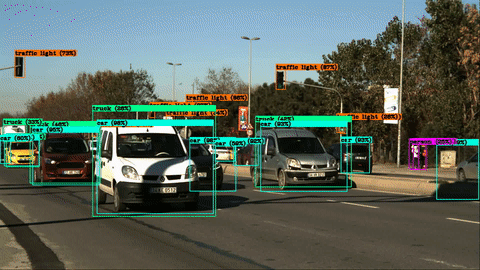
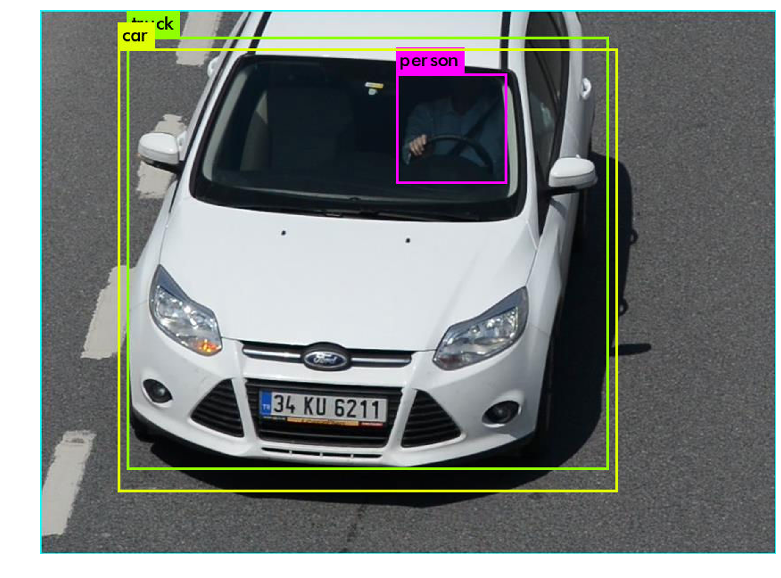

# Run YOLO V3 on Colab for images/videos

Hello there, Today, we will be discussing how we can use the Darknet project on
Google Colab platform. For those who are not familiar with these terms:



- The Darknet project is an open-source project written in C, which is a
  framework to develop deep neural networks.
- Yolo V3 is an object detection algorithm. It is one of the state of the art
  solution when **accuracy/processing power needed** metric is considered.
- Google Cola is a cloud-based data science workspace similar to the jupyter
  notebook. Each Collabrotary session is equipped with a virtual machine running
  13 GB of ram and either a CPU, GPU, or TPU processor. In most case, all the
  required packages are already installed on these machines and you can quite
  easily start development using Google Collaboratory. It saves us from
  installing process and it provides us **easy to accessible GPU's** which is
  also **free** under some constraints.

Have a look Ted Talk by Joseph Redmon the developer of the darknet project. The
talk is about Darknet and YOLO projects which titled as “How computers learn to
recognize objects instantly” . Darknet project aims to create a new neural
network framework which is completely focused on simplicity and performance. The
thing which I like about is its clarity and performance. All the code is written
in C, to define a deep learning network you should only create a config file
which defines the layers. By this way, it does not lose its performance
capabilities also it provides us easy to use interface for development with this
library.

Since I love both YOLO project and Google Colab, I decided to create a tutorial
to use them together. I create a GitHub repository and a Collaboratory notebook
for this purpose

- [Colab Notebook](https://colab.research.google.com/drive/1DcXQ_pLtLVvQAwILZR-kF0ZJwhkp11Jl)
- [mozanunal/yoloOnGoogleColab](https://github.com/mozanunal/yoloOnGoogleColab)



**Please check**

- [YOLO website](https://pjreddie.com/darknet/yolo/)
- [Darknet website](https://pjreddie.com/darknet/)
- [YOLOV3 Paper](https://arxiv.org/abs/1804.02767)

## Install

Go to the directory, clear and install everthing

- Clone the project
- Change make file configurations and make OPENCV and GPU enable
- Install opencv library

```python
import cv2, os
import matplotlib.pyplot as plt
%matplotlib inline
```

```python
!ls
!cd /content
!rm -fr darknet
!git clone https://github.com/AlexeyAB/darknet/
% cd darknet
!sed -i 's/OPENCV=0/OPENCV=1/g' Makefile
!sed -i 's/GPU=0/GPU=1/g' Makefile
!sed -i 's/CUDNN=0/CUDNN=1/g' Makefile
!apt update
!apt-get install libopencv-dev
```

## Compile and Configure

- Compile YOLO
- Download YOLO weights

```python
!make &> compile.log
```

```python
!wget https://pjreddie.com/media/files/yolov3.weights
```

    --2019-08-11 23:58:44--  https://pjreddie.com/media/files/yolov3.weights
    Resolving pjreddie.com (pjreddie.com)... 128.208.4.108
    Connecting to pjreddie.com (pjreddie.com)|128.208.4.108|:443... connected.
    HTTP request sent, awaiting response... 200 OK
    Length: 248007048 (237M) [application/octet-stream]
    Saving to: ‘yolov3.weights’

    yolov3.weights      100%[===================>] 236.52M  62.1MB/s    in 4.1s

    2019-08-11 23:58:48 (57.7 MB/s) - ‘yolov3.weights’ saved [248007048/248007048]

## Test An Image

```python
def predictImage(imageDir):
  os.system("cd /content/darknet && ./darknet detect cfg/yolov3.cfg yolov3.weights {}".format(imageDir))
  image = cv2.imread("/content/darknet/predictions.jpg")
  height, width = image.shape[:2]
  resized_image = cv2.resize(image,(3*width, 3*height), interpolation = cv2.INTER_CUBIC)

  fig = plt.gcf()
  fig.set_size_inches(18, 10)
  plt.axis("off")
  #plt.rcParams['figure.figsize'] = [10, 5]
  plt.imshow(cv2.cvtColor(resized_image, cv2.COLOR_BGR2RGB))
  plt.show()
```

```python
!wget https://github.com/mozanunal/yoloOnGoogleColab/raw/master/test/test.jpg
!ls
```

    --2019-08-11 23:58:49--  https://github.com/mozanunal/yoloOnGoogleColab/raw/master/test/test.jpg
    Resolving github.com (github.com)... 192.30.253.113
    Connecting to github.com (github.com)|192.30.253.113|:443... connected.
    HTTP request sent, awaiting response... 302 Found
    Location: https://raw.githubusercontent.com/mozanunal/yoloOnGoogleColab/master/test/test.jpg [following]
    --2019-08-11 23:58:50--  https://raw.githubusercontent.com/mozanunal/yoloOnGoogleColab/master/test/test.jpg
    Resolving raw.githubusercontent.com (raw.githubusercontent.com)... 151.101.0.133, 151.101.64.133, 151.101.128.133, ...
    Connecting to raw.githubusercontent.com (raw.githubusercontent.com)|151.101.0.133|:443... connected.
    HTTP request sent, awaiting response... 200 OK
    Length: 68535 (67K) [image/jpeg]
    Saving to: ‘test.jpg’

    test.jpg            100%[===================>]  66.93K  --.-KB/s    in 0.05s

    2019-08-11 23:58:50 (1.32 MB/s) - ‘test.jpg’ saved [68535/68535]

    3rdparty      CMakeLists.txt	      image_yolov3.sh	     results
    appveyor.yml  compile.log	      include		     scripts
    backup	      darknet		      json_mjpeg_streams.sh  src
    build	      DarknetConfig.cmake.in  LICENSE		     test.jpg
    build.ps1     darknet.py	      Makefile		     video_v2.sh
    build.sh      darknet_video.py	      net_cam_v3.sh	     video_yolov3.sh
    cfg	      data		      obj		     yolov3.weights
    cmake	      image_yolov2.sh	      README.md

```python
predictImage("test.jpg")
```



## Test with Video

```python
def predictVideo(videoDir):
  os.system(""" cd /content/darknet && ./darknet detector demo cfg/coco.data cfg/yolov3.cfg yolov3.weights \
  -dont_show {} -i 0 -out_filename res.avi
  """.format(videoDir))
```

```python
!wget https://github.com/mozanunal/yoloOnGoogleColab/raw/master/test/test.avi
!ls
```

    --2019-08-11 23:59:01--  https://github.com/mozanunal/yoloOnGoogleColab/raw/master/test/test.avi
    Resolving github.com (github.com)... 192.30.253.113
    Connecting to github.com (github.com)|192.30.253.113|:443... connected.
    HTTP request sent, awaiting response... 302 Found
    Location: https://raw.githubusercontent.com/mozanunal/yoloOnGoogleColab/master/test/test.avi [following]
    --2019-08-11 23:59:02--  https://raw.githubusercontent.com/mozanunal/yoloOnGoogleColab/master/test/test.avi
    Resolving raw.githubusercontent.com (raw.githubusercontent.com)... 151.101.0.133, 151.101.64.133, 151.101.128.133, ...
    Connecting to raw.githubusercontent.com (raw.githubusercontent.com)|151.101.0.133|:443... connected.
    HTTP request sent, awaiting response... 200 OK
    Length: 15897530 (15M) [application/octet-stream]
    Saving to: ‘test.avi’

    test.avi            100%[===================>]  15.16M  50.0MB/s    in 0.3s

    2019-08-11 23:59:02 (50.0 MB/s) - ‘test.avi’ saved [15897530/15897530]

    3rdparty	compile.log		json_mjpeg_streams.sh  src
    appveyor.yml	darknet			LICENSE		       test.avi
    backup		DarknetConfig.cmake.in	Makefile	       test.jpg
    build		darknet.py		net_cam_v3.sh	       video_v2.sh
    build.ps1	darknet_video.py	obj		       video_yolov3.sh
    build.sh	data			predictions.jpg        yolov3.weights
    cfg		image_yolov2.sh		README.md
    cmake		image_yolov3.sh		results
    CMakeLists.txt	include			scripts

```python
predictVideo("test.avi")
```

```python
!du -h res.avi
```

    93M	res.avi

```python
from google.colab import files

files.download('/content/darknet/res.avi')
```

**See you later!**
